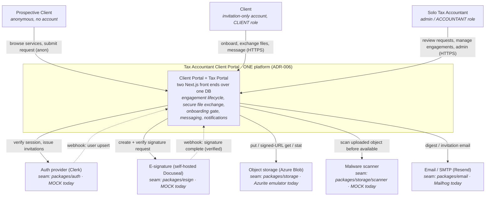

# C4 L1 — System Context

> Living description. See `README.md` for the index. Cite the ADRs that drove each structural choice.

## Status

Current as of 2026-06-19. **Backfill** of the as-built architecture across Phases 1–4 (the level was a stub).
Grounds every element in a real file path or Accepted ADR. The pre-architecture Supabase sketch in
`README.md` is retired by this document.

## Context diagram

## Elements

### Actors

- **Prospective Client (anonymous)** — no account. Browses the public services page and submits an
  engagement request through the public front door. Anonymous submission writes run under the **admin pool**
  (the one sanctioned identity-less write path; ADR-003 §7), never the request pool. Governed by
  REQ-DOOR-004. Realized by `apps/portal/src/app/(public)/services` and `.../request`.
- **Client (invited, `CLIENT` role)** — invitation-only account. Sees only their own engagement(s) — enforced
  at the database by RLS (ADR-005), not the app. Onboards (e-sign letter → questionnaire → documents),
  exchanges files, messages. Realized by `apps/portal` signed-in routes (`dashboard`, `onboarding`).
- **Solo Tax Accountant (admin, `ACCOUNTANT` role)** — the single primary user. Full visibility across all
  clients and engagements (the `ACCOUNTANT` branch of every RLS predicate passes unconditionally — ADR-005
  §2). Uses `apps/admin` (Tax Portal) as her daily work surface: request triage, engagement management,
  services/intake-template/letter-template admin, document requests. There is exactly one accountant; the
  role model has exactly two assignable roles (`packages/auth/src/port.ts` `ROLES`, AC-AUTH-001-01).

### System

- **Tax Accountant Client Portal** — **one platform, two front ends** (ADR-006). The Client Portal
  (`apps/portal`) and the Tax Portal (`apps/admin`) are not two systems; they are two audiences/threat-models
  of a single product backed by **one SQL Server database, one schema, one RLS policy set, one storage
  namespace** (L2). This single-system framing is the load-bearing L1 fact.

### External systems (all behind provider seams — ADR-023)

The standing user directive (memory: mock-third-party) and ADR-023 require every external integration to sit
behind a `port + bindings + fail-closed select` seam and stay **mock/emulated as long as possible**, with the
real binding deferred to a per-integration "enablement" slice. Current as-built state:

| External system | Seam (package) | Real binding (deferred) | **Current binding** | Governing ADR |
|---|---|---|---|---|
| Auth provider | `packages/auth` (`port.ts`, `select.ts`) | Clerk (`bindings/clerk.ts`) | **mock** (`bindings/mock.ts`, `ALLOW_MOCK_AUTH`) | ADR-001, ADR-023 |
| E-signature | `packages/esign` | self-hosted Docuseal (`bindings/docuseal.ts`) | **mock** (`bindings/mock.ts`, `ALLOW_MOCK_ESIGN`) | ADR-024, ADR-023 |
| Object storage | `packages/storage` | Azure Blob (`cloud` adapter, unbound) | **Azurite emulator** (`adapters/azurite.ts`) | ADR-008, ADR-009 |
| Malware scanner | `packages/storage/scanner` | cloud AV (`bindings/cloud.ts`, fail-closed) | **mock** (`bindings/mock.ts`, `ALLOW_MOCK_SCANNER`) | ADR-021, ADR-023 |
| Email / SMTP | `packages/email` | Resend (`bindings/resend.ts`) | **Mailhog via SMTP** (`bindings/smtp.ts`) | ADR-025, ADR-023 |

Security-critical seams (auth, scanner, e-sign validity, key custody) are **fail-closed pre-deploy gates**: a
mock binding in production does not ship (ADR-023 §5). The mock proves wiring, not the provider's security
property (ADR-023 §6).

## Relationships

- **Browser → system over HTTPS.** All three actor classes reach the system from a web browser only (v1; no
  mobile/native). Prospective clients are anonymous; clients and the accountant carry one Clerk session that
  covers **both** front ends (ADR-010 §3 — one Clerk application, cookie scoped to the apex).
- **System → external systems via the seam.** No app code calls a provider SDK directly; everything goes
  through the package port. Inbound webhooks (Clerk user upsert; Docuseal verified signature completion) land
  on the portal surface and run under the admin pool (ADR-010 §6, ADR-024 §3).
- **The database is the trust boundary** (ADR-005), not the front ends. Role and row access are evaluated by
  SQL Server RLS against a server-verified identity (ADR-003), so a compromised or buggy front end cannot leak
  another client's rows.

## Notes

- **Governing ADRs:** ADR-006 (one platform / two front ends — the central L1 fact), ADR-001 (Clerk auth),
  ADR-023 (provider-seam, mock-first — why most external systems are mocks today), ADR-005 + ADR-003
  (database trust boundary + identity propagation), ADR-024/ADR-025/ADR-021/ADR-008 (the individual external
  seams). **Governing requirements:** REQ-DOOR-004 (self-serve front door), REQ-AUTH-* (roles, sessions),
  REQ-ONBD-002 (onboarding e-sign gate).
- **Current vs. eventual.** Every "MOCK today" external system has a real binding already coded behind the
  same port; flipping it on is a deferred enablement slice (env change + re-validation), not a redesign — this
  is the mock-first posture (ADR-023 §2). Docuseal + its own Postgres are present in `docker-compose.yml` but
  commented out (the e-sign mock is the active path).
- **Production host is deferred** (ADR-007); L1 is host-agnostic. The portal must not assume Azure-specific
  features (ADR-002/ADR-013).
