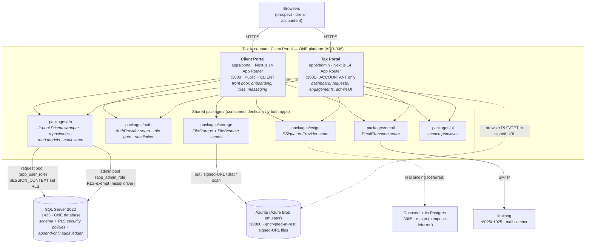

# C4 L2 — Containers

> Living description. See `README.md` for the index. Cite the ADRs that drove each structural choice.

## Status

Current as of 2026-06-19. **Backfill** of the as-built container topology (the level was a stub). The local
stack is `docker-compose.yml`; the two app containers are live (`portal`, `admin`); Docuseal + its Postgres
are present but commented out (mock e-sign is the active path).

## Container diagram

## Elements

### `apps/portal` — Client Portal (Next.js 14, App Router) — port 3000

Client-facing front end. Owns the public front door (`(public)/services`, `(public)/request`,
`(public)/sign-in`, `(public)/sign-up`), the signed-in client `dashboard`, the `onboarding` flow, the
`api/mock-session` endpoint, and `healthz`/`readyz`. Middleware (`src/middleware.ts`) verifies the session,
blocks non-CLIENT roles with a cross-app redirect, and establishes `withRequestContext` (ADR-010, ADR-003).
Per-app `Dockerfile` and `playwright.config.ts`. **The only app with a `packages/storage` dependency** — file
exchange lives on the portal (the admin compose service intentionally omits `STORAGE_*` and the Azurite
`depends_on`). Governed by ADR-006, ADR-007, ADR-010.

### `apps/admin` — Tax Portal (Next.js 14, App Router) — port 3001

Accountant-facing front end. Owns `requests` (triage + accept/decline), `engagements/[engagementId]`
(+ `document-requests`), `services` admin, and `settings/letter-template` + `settings/questionnaire-templates`
admin UI, plus `api/mock-session`, `healthz`/`readyz`. **No public routes** — middleware
(`src/middleware.ts`) blocks every non-ACCOUNTANT request with a redirect to the portal (ADR-010 §1). Per-app
`Dockerfile` and `playwright.config.ts`. Governed by ADR-006, ADR-007, ADR-010.

> Both apps are **one platform** (ADR-006): same Clerk application (one session covers both — ADR-010 §3),
> same database, same schema, same RLS policy set, same `packages/db` wrapper. They never call each other's
> HTTP endpoints — cross-app coordination travels through the shared DB (ADR-010 §5).

### `packages/*` — shared libraries (workspace-linked, not deployable units)

Realize the cross-cutting decisions. They are *components* of the apps that consume them (detailed at L3),
listed here because they are the shared substrate both apps bind:

- **`packages/db`** — two Prisma pools + the `$extends` SESSION_CONTEXT wrapper + repositories + onboarding/
  checklist read models + the audit-write seam. ADR-003/004/005/011/019.
- **`packages/auth`** — `AuthProvider` port + bindings (clerk/mock) + `select` + `require-role` redirect gate
  + an in-memory rate limiter. ADR-001/010/022/023.
- **`packages/storage`** — `FileStorage` port + adapters (azurite/memory) + `FileScanner` scanner seam +
  content-type/size validation + TTL caps. ADR-008/009/021/023.
- **`packages/esign`** — `ESignatureProvider` port + bindings (docuseal/mock) + `select`. ADR-024/023.
- **`packages/email`** — email transport port + bindings (resend/smtp/mock) + `select`. ADR-025/023.
- **`packages/ui`** — shadcn/ui primitives shared across both apps (ADR-006 § packages/ui).

### SQL Server 2022 — the one database — port 1433

`mcr.microsoft.com/mssql/server:2022-latest`, Developer edition in dev (ADR-002). One database backs both
apps. Holds: the Prisma entity schema (`prisma/schema.prisma` — `Service`, `EngagementRequest`,
`EngagementRequestService`, `User`, `Engagement`, `LetterTemplate`, `QuestionnaireTemplate`,
`QuestionnaireAnswer`, `DocumentRequest`, `Document`, `Notification`); the **RLS security policies**
(`db/policies/0001–0007`, ADR-005); and the **append-only audit ledger** (`db/migrations/0002-create-audit-ledger.sql`,
`AuditEvent` table, `LEDGER = ON` — ADR-019). Two migration tracks: Prisma (`prisma/migrations/`) +
raw SQL (`db/migrations/`, `db/policies/`), sequenced by `scripts/db-migrate.ts` (ADR-002 § Migration tracks).

### Azurite — Azure Blob emulator — port 10000

`mcr.microsoft.com/azure-storage/azurite`. The local-dev/CI binding of the `FileStorage` port (ADR-008). Holds
document objects keyed `engagements/{id}/documents/{id}/v{n}/{filename}` (ADR-009), encrypted at rest by
adapter contract. The eventual production binding is Azure Blob (the `cloud` adapter is unbound and
fail-closed at boot — ADR-008).

### Mailhog — mail catcher — ports 8025 (UI) / 1025 (SMTP)

Local SMTP sink for the `packages/email` SMTP binding (the deferred real binding is Resend — ADR-025).

### Docuseal + its own Postgres — port 3005 — **compose-deferred**

Self-hosted e-sign service (ADR-024). Present in `docker-compose.yml` but **commented out**; the active e-sign
path is the mock binding. Its Postgres is internal to Docuseal and is **not** the application database.

## Relationships

- **Two DB access paths, one wrapper package (ADR-003 §1).**
  - **Request pool** (`db`, `app_user_role`, low-privilege): every request-scoped query. The `$extends`
    wrapper sets `SESSION_CONTEXT(clerk_user_id, role)` from the verified identity before the first query;
    RLS predicates filter/block on it. Fail-closed: null identity → zero rows; missing request context → throw.
  - **Admin pool** (`adminDb` / `getAdminPool`, `app_admin_role`, elevated, RLS-exempt): migrations, webhooks,
    cron, seed, the anonymous request-submit write, two-phase upload row inserts, and same-transaction audit
    writes. Never shares a connection with the request pool; import-restricted by ESLint (ADR-003 §6).
  - Note the runtime split observed in code: the wrapped Prisma `db`/`adminDb` clients serve the ORM 90%-case,
    while same-transaction atomic writes (audit) use the npm `mssql` driver pool via `getAdminPool`
    (`packages/db/src/admin-connection.ts`, `audit.ts`) — both are admin-principal paths.
- **Signed-URL file access (ADR-009).** The app never proxies bytes. The portal authorizes on the request pool
  (RLS-scoped read), then mints a time-limited signed URL through `packages/storage`; the browser PUTs/GETs
  directly to Azurite. Local dev rewrites the URL origin (`BLOB_PUBLIC_ENDPOINT`) so the host browser can
  reach the container.
- **Apps ↔ DB are the only cross-app channel.** No `apps/portal` ↔ `apps/admin` HTTP (ADR-006/ADR-010 §5).
- **Per-app health.** Each app exposes `/healthz` + `/readyz`; `scripts/smoke-test.sh` probes both (ADR-007,
  ADR-006).

## Notes

- **Governing ADRs:** ADR-002 (SQL Server 2022), ADR-003 (two pools + SESSION_CONTEXT path), ADR-004 (Prisma),
  ADR-005 (RLS policies), ADR-006 (monorepo / two front ends), ADR-007 (per-app container packaging,
  deploy-deferred), ADR-008 (object storage + Azurite), ADR-009 (signed-URL access), ADR-010 (cross-app
  navigation / one session), ADR-019 (audit ledger), ADR-024/025 (e-sign / email containers + seams).
- **Mock/emulated containers today:** Azurite (stands in for Azure Blob), Mailhog (stands in for Resend), and
  the mock auth/esign/scanner bindings are in-process (no container). The deferred-real set is tracked per
  ADR-023.
- **Deferred:** production deploy platform (ADR-007); the `cloud` storage adapter; Docuseal bring-up; an SSE
  realtime channel (ADR-010 §5 — portal reads DB on next request until it lands).
