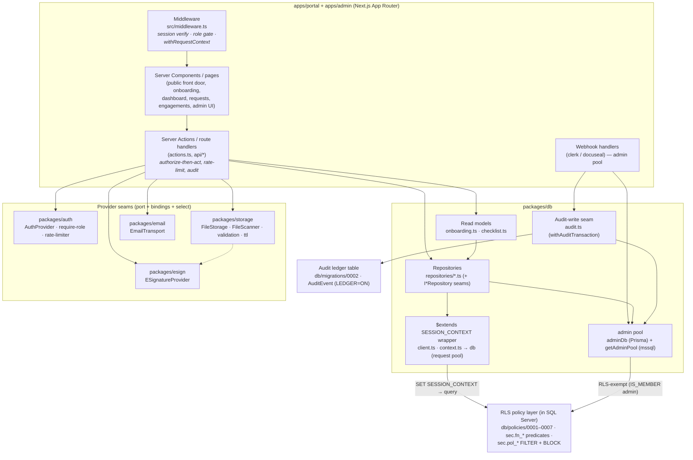

# C4 L3 — Components

> Living description. See `README.md` for the index. Cite the ADRs that drove each structural choice.

## Status

Current as of 2026-06-19. **Backfill** of the as-built components inside the containers (the level was a stub).
Components are grounded in real source paths under `packages/*` and `apps/*`.

## Component diagram

## Elements

### App-layer components (both `apps/portal` and `apps/admin`)

- **Middleware** (`src/middleware.ts`) — the role gate and request-context spine. Verifies the session via
  `packages/auth`, applies the cross-app redirect matrix (ADR-010 §1), and wraps the request in
  `withRequestContext(clerkUserId, role, …)` so downstream DB queries reach RLS with identity. Symmetric
  across both apps; differs only in the public-route allow-list and the role-gate branch. ADR-010, ADR-003 §6.
- **Server Components / pages** — render the front-door, onboarding, dashboard, request-triage, engagement,
  and admin-template surfaces. Read through `packages/db` repositories/read-models under the request pool.
- **Server Actions / route handlers** (`actions.ts`, `api/*`) — the mutation + authorize-then-act layer. This
  is where the **authorize-then-sign** (ADR-009), **rate-limit** (ADR-022), and **same-transaction audit**
  (ADR-019) concerns are composed around repository calls (the repositories deliberately leave rate-limit +
  audit to the caller — see `repositories/document.ts` DECISION notes).
- **Webhook handlers** (`api/mock-session`; future Clerk/Docuseal) — run under the admin pool; they upsert/
  flip state before the caller has any owned rows (ADR-010 §6, ADR-024 §3). Audited in-transaction.

### `packages/db` components

- **`$extends` SESSION_CONTEXT wrapper** (`client.ts` + `context.ts`) — the load-bearing identity-propagation
  component. Exports the wrapped **`db`** (request pool, `app_user_role`) that runs `sp_set_session_context`
  once per request before the first query; throws if no request context exists (fail-closed). Detailed at L4.
  ADR-003 §2.
- **Admin pool** — `adminDb` (Prisma Proxy, lazy) for RLS-exempt ORM writes and `getAdminPool()`
  (`admin-connection.ts`, npm `mssql`) for raw same-transaction writes. Import-restricted by ESLint to
  webhooks/scripts/jobs/seed (ADR-003 §6/§7).
- **Repositories** (`repositories/*.ts`: engagement, engagement-request, document, document-request, service,
  notification, letter-template, questionnaire-template, questionnaire-answer) — the data-access boundary and
  the ADR-011 test seam (`I<Entity>Repository` interfaces where service logic carries unit tests). Each
  repository annotates its **pool strategy** (request pool for FILTER-governed reads + BLOCK-governed client
  writes; admin pool for accept-time / pending-insert writes). The barrel (`index.ts`) deliberately **does
  not** export the admin-pool BLOCK-bypassing variants (`recordLetterSignature`, `submitQuestionnaireAnswer`,
  `insertPendingDocument`, `completeUpload`) — those are imported from source modules only.
- **Read models** (`onboarding.ts`, `checklist.ts`) — derive the onboarding spine. `resolveOnboarding`
  computes the three ordered steps (`engagement-letter` → `intake-questionnaire` → `document-upload`) and
  per-step `accessible`/`done` **server-side from engagement state** (never stored); `checkStepAccessibility`
  is the server-side hard gate that refuses locked steps. `resolveChecklist` derives required-document
  fulfillment. ADR-003 (gate is server-evaluated), AC-ONBD-001/002/003/004.
- **Audit-write seam** (`audit.ts`) — `recordAuthEvent` + `withAuditTransaction` write tamper-evident audit
  rows into the `AuditEvent` ledger **in the same transaction as the mutation** (fail-closed). Actor identity
  is always the server-verified principal, never client input. INSERT-only (append-only ledger). ADR-019 §2/§3.

### RLS policy layer (lives inside SQL Server, authored on the raw-SQL track)

- **Predicate functions + security policies** (`db/policies/0001–0007`) — `sec.fn_<resource>_access` inline
  TVFs bound to tables as `sec.pol_<table>` **FILTER** (reads) and **BLOCK** (writes) predicates. Coverage as
  built: engagement-request (0001), service-readable (0002), audit-event (0003 — accountant/admin read only,
  CLIENT denied entirely), notification (0004), engagement (0005), questionnaire (0006), document (0007).
  Every predicate's branches: admin principal pass → ACCOUNTANT pass → CLIENT owning/participating rows.
  Fail-closed on null identity. ADR-005. This component is the **trust boundary** — both front ends and both
  DB-access components route through it (admin pool is the documented exemption).

### Provider seams (port + bindings + fail-closed select — ADR-023)

- **`packages/auth`** — `AuthProvider` port (`port.ts`: `getIdentity`/`getSessionRole`/`checkSession`/
  `createInvitation`), `select.ts` (fail-closed; mock requires `ALLOW_MOCK_AUTH`), `require-role.ts`
  (the redirect gate helper), `redirect.ts` (ADR-010 matrix), and an in-memory rate limiter
  (`rate-limiter/`, ADR-022). Bindings: `clerk.ts` (real, deferred) + `mock.ts` (active).
- **`packages/storage`** — `FileStorage` port (`types.ts`) + adapters (`azurite.ts` active, `memory.ts` tests,
  `cloud` fail-closed); the **`FileScanner`** scanner seam (`scanner/port.ts` + `bindings/mock.ts` active +
  `bindings/cloud.ts` fail-closed); content/MIME + size `validation.ts`; signed-URL TTL caps `ttl.ts`.
  ADR-008/009/021.
- **`packages/esign`** — `ESignatureProvider` port (`createSignatureRequest`/`verifyCompletion`) + bindings
  (`docuseal.ts` real-deferred, `mock.ts` active) + `select.ts` (mock requires `ALLOW_MOCK_ESIGN`). ADR-024.
- **`packages/email`** — email transport port + bindings (`resend.ts` real-deferred, `smtp.ts`→Mailhog active,
  `mock.ts` tests) + `select.ts`. ADR-025.

## Relationships

- **The onboarding gate spine** is the cross-component flow that ties the system together: middleware
  establishes identity → a server action loads the engagement through the request pool (RLS FILTER) →
  `checkStepAccessibility` (read model) refuses locked steps → the e-sign seam (`packages/esign`) drives the
  letter → on verified completion the engagement's `letterSignedAt` is set, which `resolveOnboarding`
  re-derives to unlock steps 2/3 → questionnaire submit and document upload follow, each authorize-then-act
  with audit. ADR-024, ADR-009, ADR-021, ADR-019.
- **Authorize-then-sign (ADR-009)** is composed in the action layer, not in storage: the action authorizes via
  a request-pool RLS read, *then* calls `packages/storage` to mint a signed URL (signing uses adapter
  credentials, orthogonal to the request principal — ADR-008 §"signing under admin principal").
- **Repository ↔ pool** — request-pool repository methods go through the `$extends` wrapper (RLS applies);
  admin-pool methods bypass RLS by principal. Read models compose repository results; they hold no SQL.
- **Audit seam ↔ ledger** — `withAuditTransaction` opens an `mssql` transaction on the admin pool and binds the
  audit INSERT to the mutation so both commit or both roll back (ADR-019 §3).

## Notes

- **Governing ADRs:** ADR-003 (`SESSION_CONTEXT` wrapper, request-context spine), ADR-005 (RLS policy
  component), ADR-011 (repository interface test seam), ADR-019 (audit-write seam + ledger), ADR-009/021
  (authorize-then-sign + scan-before-available, composed in the action layer), ADR-023 (the four provider
  seams), ADR-010 (middleware role gate).
- **Mock state at this level:** the auth/esign/scanner bindings are the mock components today; the
  storage adapter is Azurite; email is SMTP→Mailhog. Each has its real binding coded behind the same port,
  deferred to an enablement slice (ADR-023 §2).
