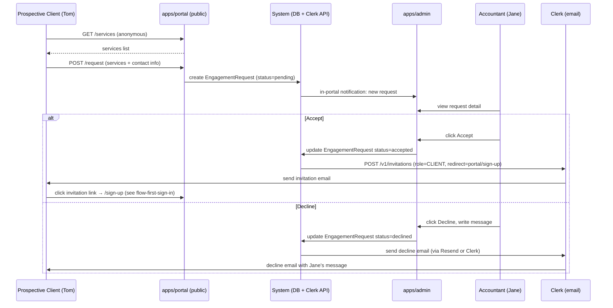

# Flow: Engagement Request

**Flow ID:** `flow-engagement-request`  
**One-line summary:** A prospective or returning client submits a service engagement request via the public front door; the accountant reviews and accepts or declines; on acceptance an invitation email is sent to the client.

**Status:** Phase 2 — covers Epic 002 (Front Door) scope. Not required for Epic 001 Plan, but authored here to satisfy the flow-gate before Epic 002 begins.

---

## Actors

| Actor | Persona | Role in this flow |
|---|---|---|
| Prospective Client | `tom-prospective-client` | Anonymous user submitting the initial request. |
| Returning Client | `sarah-returning-client` | Authenticated CLIENT requesting a new engagement from inside the portal. |
| Accountant | `jane-accountant` | Reviews, accepts, or declines the request from `apps/admin`. |
| System | — | Creates `EngagementRequest` row, sends notifications, calls Clerk API to issue invitation. |

---

## Preconditions

**Anonymous (prospective client) path:**
- The public services page (`apps/portal/services`) is accessible without authentication.
- At least one active `Service` exists in the catalog.
- The prospective client has not yet created a portal account.

**Returning client path:**
- The CLIENT is signed in to `apps/portal`.
- The CLIENT has an existing `User` row (`role: 'CLIENT'`).
- At least one active `Service` exists that the client has not already engaged for this tax year.

---

## Steps — Anonymous (Prospective Client) Path

1. **[Prospective Client / Anonymous] Browses public services page.**
   - Actor: Tom (`tom-prospective-client`).
   - Action: Navigates to `apps/portal` public services page. No authentication required. Views service descriptions and estimated timelines.
   - REQ-DOOR-001 — public services page accessible without authentication.
   - REQ-DOOR-002 — services catalog managed by accountant.
   - Observable outcome: Services list renders. Checklist items are selectable.

2. **[Prospective Client] Selects services and submits request form.**
   - Actor: Tom.
   - Action: Checks one or more services on the checklist. Fills in contact info (name, email, phone). Submits the form.
   - REQ-DOOR-003 — checklist of active services, not freeform.
   - REQ-DOOR-004 — no account created at this step; basic contact info submitted.
   - Observable outcome: `EngagementRequest` row created with `status: pending`. Confirmation message shown to Tom ("Your request has been sent…").

3. **[System] Notifies accountant.**
   - Actor: System.
   - Action: Creates in-portal notification for Jane: "New engagement request from [name]."
   - REQ-DOOR-005, REQ-MSG-013 — accountant notified of new request.
   - Observable outcome: Jane sees notification badge on `apps/admin` dashboard.

4. **[Accountant] Reviews request in `apps/admin`.**
   - Actor: Jane (`jane-accountant`).
   - Action: Opens notification, navigates to request detail in `apps/admin`. Reviews service selection and contact info.
   - REQ-DASH-011 — admin UI shows all engagement requests.
   - Observable outcome: Request detail rendered. Accept / Decline actions available.

5. **[Accountant] Accepts the request.**
   - Actor: Jane.
   - Action: Clicks Accept. System calls Clerk backend API to create an invitation with `publicMetadata.role: 'CLIENT'` and redirect URL pointing at `apps/portal/sign-up`.
   - REQ-DOOR-006 — accountant may accept or decline.
   - REQ-DOOR-007 — on acceptance, invitation email sent to client.
   - ADR-001 § Invitation flow — Clerk sends the invitation email.
   - Observable outcome: `EngagementRequest.status` → `accepted`. Clerk invitation created. Invitation email sent by Clerk to the prospective client.

6. **[Prospective Client] Receives invitation email and signs up.**
   - Actor: Tom.
   - Action: Opens Clerk invitation email. Clicks link. Lands on `apps/portal/sign-up`. Completes sign-up.
   - REQ-AUTH-006 — invitation-only account creation.
   - See `flow-first-sign-in` for detailed sign-up steps.
   - Observable outcome: Tom becomes a CLIENT with a `User` row. Signed in to `apps/portal`.

---

## Steps — Returning Client Path

1. **[Returning Client] Initiates new engagement request from portal home.**
   - Actor: Sarah (`sarah-returning-client`) — already signed in to `apps/portal`.
   - Action: Clicks "Request new service" from her portal home or engagement list. System shows a simplified service checklist (same services as public page, filtered to exclude duplicates for current tax year where applicable).
   - REQ-DOOR-009 — returning clients may request from inside the portal via simplified flow.
   - Observable outcome: Simplified request form renders (contact info pre-filled from `User` record).

2. **[Returning Client] Selects services and submits.**
   - Actor: Sarah.
   - Action: Selects desired services. Submits. No contact info re-entry required (pre-filled).
   - REQ-DOOR-004 — `EngagementRequest` row created, this time linked to her `User.id`.
   - Observable outcome: Confirmation shown. `EngagementRequest` created with `status: pending`.

3. **[System] Notifies accountant.** _(same as anonymous path step 3)_

4. **[Accountant] Reviews and accepts.** _(same as anonymous path steps 4–5, with the distinction that the invitee already has an account — Clerk invitation may not be needed; Jane may trigger a notification instead)_
   - Note for Epic 002: if the returning client already has an account, the acceptance flow should notify the existing CLIENT user rather than sending a Clerk invitation. This detail is to be resolved during Epic 002 design.

---

## Decline Branch

**D1 — Accountant declines the request:**

1. Jane clicks Decline on the request.
2. System prompts Jane to write a brief decline message.
3. Jane submits the decline message.
4. System sends the message to the prospective client's email address.
5. `EngagementRequest.status` → `declined`.
6. Prospective client receives decline email. They have no portal account and nothing to log in to.

- REQ-DOOR-008 — on decline, brief message sent via email; portal storage TBD (CLARIF-001 unresolved).

---

## Accountant-Initiated Branch

**AI1 — Accountant creates engagement on behalf of existing client:**

1. Jane navigates to an existing client's record in `apps/admin`.
2. Clicks "New engagement" and selects service type and tax year.
3. System creates an `Engagement` directly (no `EngagementRequest` needed) with `status: New`.
4. Jane sets up the document checklist and sends the engagement letter to begin onboarding.

- REQ-DOOR-010 — accountant may initiate a new engagement directly for an existing client.

---

## Postconditions

**Accept path (new client):**
- `EngagementRequest.status` is `accepted`.
- A Clerk invitation has been created and an email has been sent to the new client.
- When the client completes sign-up, a `User` row exists and an `Engagement` is created with `status: New`.
- Onboarding flow begins (see `flow-onboarding`).

**Accept path (returning client):**
- `EngagementRequest.status` is `accepted`.
- A new `Engagement` is created for the existing client with `status: New`.
- Client is notified via in-portal notification and email digest nudge.

**Decline path:**
- `EngagementRequest.status` is `declined`.
- Decline message sent via email to prospective client.
- No account created. No engagement created.

---

## Mermaid Diagram

---

## Linked Requirements

- REQ-DOOR-001 — public services page
- REQ-DOOR-002 — services catalog managed by accountant
- REQ-DOOR-003 — checklist form, not freeform
- REQ-DOOR-004 — anonymous request, no account required
- REQ-DOOR-005 — accountant notification on new request
- REQ-DOOR-006 — accountant may accept or decline
- REQ-DOOR-007 — invitation email on acceptance
- REQ-DOOR-008 — decline message via email (CLARIF-001 open)
- REQ-DOOR-009 — returning client simplified flow
- REQ-DOOR-010 — accountant-initiated engagement
- REQ-AUTH-006 — invitation-only account creation
- REQ-MSG-013 — notification types for accountant
- REQ-DASH-011 — admin UI shows all requests
