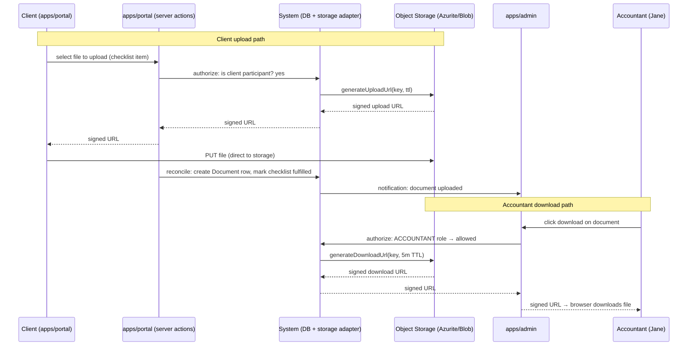

# Flow: File Exchange

**Flow ID:** `flow-file-exchange`  
**One-line summary:** An accountant or client uploads or downloads a file within an engagement; files are stored via signed-URL object storage, access is authorized per SQL Server Security Policies, and a version history is maintained.

**Status:** Phase 4 stub — covers Epic 004 (Secure File Exchange) scope. Authored here for flow-gate completeness; to be refined during Epic 004 pre-planning.

---

## Actors

| Actor | Persona | Role in this flow |
|---|---|---|
| Client | `sarah-returning-client`, `martha-and-james-married-couple` | Uploads files requested by accountant; downloads files provided by accountant. |
| Accountant | `jane-accountant` | Uploads completed returns and other files; downloads client-uploaded documents; creates document requests; manages folder structure. |
| System | — | Authorizes file operations via SQL Server Security Policies, generates signed URLs via storage adapter, records `Document` and `DocumentRequest` rows, sends notifications. |

---

## Preconditions

- An `Engagement` exists and the user is authorized to access it (via SQL Server Security Policies and `EngagementParticipant` table).
- The storage adapter (`packages/storage` — ADR-008) is initialized.
- For uploads: a `Folder` record exists for the target folder (or the accountant creates one).

---

## Steps — Client Uploads a Document

1. **[Client] Views document checklist in `apps/portal`.**
   - Actor: CLIENT.
   - Action: Opens engagement file view. Sees document checklist with outstanding items (e.g., "W-2", "Schedule E"). Each item shows `fulfilled` or `outstanding`.
   - REQ-FILE-008 — document checklist per engagement, clients see outstanding items.
   - Observable outcome: Checklist rendered.

2. **[Client] Requests an upload signed URL.**
   - Actor: CLIENT → System.
   - Action: Client selects a file from their local device to upload against a checklist item. System performs authorization check (client is a participant in this engagement → allowed). System calls the storage adapter to generate a pre-signed upload URL with a short TTL.
   - REQ-FILE-003 — signed URLs only; never publicly accessible.
   - ADR-009 § Authorize-then-sign pattern — authorization must precede signing.
   - ADR-008 § Interface — `generateUploadUrl(key, ttl)`.
   - Observable outcome: Signed upload URL returned to client app.

3. **[Client] Uploads file directly to storage.**
   - Actor: CLIENT (browser PUT to signed URL).
   - Action: Client browser PUTs the file directly to the storage endpoint using the signed URL. File is encrypted at rest (AES-256) by the storage layer.
   - REQ-FILE-003 — AES-256 at rest.
   - REQ-FILE-002 — any file type permitted.
   - Observable outcome: File stored in object storage at key `engagements/{engagementId}/documents/{documentId}/v1/{filename}` (per ADR-009 § Key structure).

4. **[System] Reconciles upload and creates `Document` row.**
   - Actor: System (reconciliation — immediate or via cron, per ADR-009 § Two-phase upload).
   - Action: System confirms file exists in storage. Creates `Document` row: `engagementId`, `folderId`, `uploadedById`, `storagePath`, `label`, `version: 1`. Marks `DocumentRequest` as fulfilled if applicable.
   - REQ-FILE-008 — checklist item marked fulfilled.
   - REQ-FILE-009 — version history: first upload creates `version: 1`.
   - Observable outcome: `Document` row in DB. Checklist item shows `fulfilled`. Accountant receives notification.

5. **[System] Notifies accountant.**
   - Actor: System.
   - Action: Creates in-portal notification for Jane: "Document uploaded — [client name] — [label]."
   - REQ-MSG-013 — accountant notification type: document uploaded.
   - Observable outcome: Jane's notification badge increments.

---

## Steps — Accountant Downloads a Client-Uploaded Document

1. **[Accountant] Views document list for engagement in `apps/admin`.**
   - Actor: Jane.
   - Action: Navigates to engagement file view. Sees folders and documents.
   - REQ-FILE-010, REQ-FILE-011 — folder-structured, organized by engagement and tax year.
   - Observable outcome: Document list rendered.

2. **[Accountant] Requests a download signed URL.**
   - Actor: Jane → System.
   - Action: Clicks download on a document. System performs authorization check (ACCOUNTANT role → allowed for this engagement). System calls storage adapter to generate a pre-signed download URL with TTL.
   - REQ-FILE-003 — signed URL with expiry.
   - ADR-009 § Default TTLs — 5 minutes for downloads.
   - Observable outcome: Signed download URL returned.

3. **[Accountant] Downloads file.**
   - Actor: Jane (browser GET to signed URL).
   - Action: Browser follows the signed URL and downloads the file from storage.
   - Observable outcome: File downloaded. URL expires after TTL.

---

## Steps — Accountant Uploads a Completed Return

1. **[Accountant] Creates folder (if needed) and uploads return.**
   - Actor: Jane.
   - Action: Navigates to engagement in `apps/admin`. Creates a folder "2025 Return Deliverables" (if it doesn't exist). Uploads the completed return PDF into that folder.
   - REQ-FILE-010 — accountant creates and manages folder structure.
   - Steps 2–4 mirror the client upload steps above (signed URL request → PUT → reconciliation).

2. **[System] Notifies client.**
   - Actor: System.
   - Action: Creates in-portal notification for client: "A deliverable is ready."
   - REQ-MSG-014 — client notification type: deliverable ready.

---

## Steps — Accountant Creates Document Request

1. **[Accountant] Creates a labeled document request in `apps/admin`.**
   - Actor: Jane.
   - Action: Navigates to engagement file view. Clicks "New document request." Enters label ("Please upload your Schedule E — corrected") and optional due date.
   - REQ-FILE-007 — accountant may create labeled document requests.
   - Observable outcome: `DocumentRequest` row created. Client receives notification.

2. **[Client] Receives notification and uploads the document.**
   - Actor: CLIENT.
   - Action: Receives in-portal notification ("New document request: Please upload your Schedule E"). Opens engagement file view. Uploads the file against the request. `DocumentRequest.fulfilledAt` is set.
   - REQ-MSG-014 — client notification type: document request created.
   - Observable outcome: Checklist item fulfilled.

---

## Branches

### B1 — Replacing a document (version history)

- Client re-uploads a corrected document for the same checklist item.
- System creates a new `Document` row with `version: 2` (or incremented). Previous version row retained — `Document.version: 1` remains in DB and storage.
- REQ-FILE-009 — version history; previous versions retained.
- Both versions are accessible from the document history view.

### B2 — Accountant soft-deletes a document

- Jane clicks Delete on a document.
- System sets `Document.deletedAt` to the current timestamp. File is NOT removed from storage.
- The document is hidden from the default view but retained for the 7-year retention window.
- REQ-FILE-004 — only accountant may delete.
- REQ-FILE-005, REQ-FILE-006 — 7-year retention via soft-delete.

### B3 — Signed URL expires before client downloads

- Client receives a download signed URL. Waits too long (past TTL). Tries to download — storage returns 403/expired.
- Client refreshes the page / clicks download again. A new signed URL is generated.
- ADR-009 § TTLs — 5 min download TTL by default.

### B4 — Overdue document request auto-reminder

- A `DocumentRequest` passes its `dueDate` with `fulfilledAt` still null.
- The scheduled background job (REQ-MSG-018, ADR-009-cron) detects the overdue request.
- System creates an in-portal notification for Jane (type: document_request_overdue) and may send an email nudge to the client.
- REQ-FILE-012, REQ-MSG-013, REQ-MSG-018.

---

## Postconditions

- File is stored in object storage at the defined key structure.
- `Document` row exists in SQL Server with correct `version`, `engagementId`, `folderId`, `uploadedById`.
- If the upload fulfilled a `DocumentRequest`, `DocumentRequest.fulfilledAt` is set.
- Relevant party has received an in-portal notification.
- File is accessible only via time-limited signed URLs.

---

## Mermaid Diagram

---

## Linked Requirements

- REQ-FILE-001 — both parties upload and download
- REQ-FILE-002 — any file type
- REQ-FILE-003 — AES-256 at rest, signed URLs
- REQ-FILE-004 — only accountant may delete
- REQ-FILE-005 — 7-year retention
- REQ-FILE-006 — soft-delete
- REQ-FILE-007 — labeled document requests
- REQ-FILE-008 — document checklist
- REQ-FILE-009 — version history
- REQ-FILE-010 — folder structure (accountant-managed)
- REQ-FILE-011 — top-level by engagement + tax year
- REQ-FILE-012 — auto-reminder for overdue requests
- REQ-MSG-013 — accountant: document uploaded notification
- REQ-MSG-014 — client: document request created, deliverable ready notifications
- REQ-MSG-018 — scheduled background job for overdue reminders
- REQ-NFR-002 — signed URLs with expiry, never public
