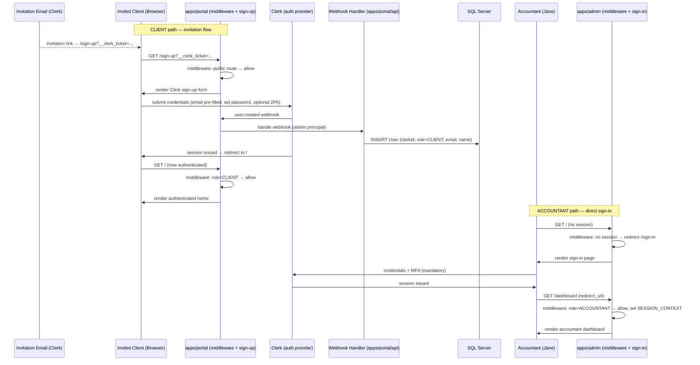

# Flow: First Sign-In

**Flow ID:** `flow-first-sign-in`  
**One-line summary:** A user (invited CLIENT or ACCOUNTANT) authenticates for the first time and lands on the correct app surface based on their role.

**Status:** Phase 1 (MVP) — realized by **EPIC-004** (authentication & the two-role model: auth shell,
middleware, role-gated routing, invitation → client account creation). Reconciled 2026-06-14 (the old
"Epic 001 scope" label predated the current numbering — EPIC-001 is the anonymous front door; auth is
EPIC-004). The invitation that triggers the CLIENT path is issued by **EPIC-003** (accept → invite).

**Provider note (2026-06-20):** EPIC-004 delivered this flow against the **mocked** auth seam
(`AUTH_PROVIDER=mock`). **EPIC-009** (Phase 3) is the **PoC two-role sign-in lane** — it realizes the
**sign-in entry** of this flow under the mock seam (a dev sign-in page + role/user switcher over
`/api/mock-session`), so the PoC is demoable as the Accountant or a Client; it does **not** wire real Clerk.
**All real-provider work** — real Clerk sign-in (re-validating the ACCOUNTANT/CLIENT sign-in + redirect
portions against the live provider), the **real invitation → sign-up** path, and **mandatory ACCOUNTANT MFA /
2FA** — lives in the end-of-cycle **Phase 5 — Production Readiness** placeholder. The journey is unchanged;
only the provider behind it changes.

---

## Actors

| Actor | Persona | Role in this flow |
|---|---|---|
| Invited CLIENT | `tom-prospective-client` (post-acceptance), `sarah-returning-client`, `martha-and-james-married-couple` | Accepts invitation, creates portal account, lands on `apps/portal`. |
| ACCOUNTANT | `jane-accountant` | Authenticates directly on `apps/admin`, lands on dashboard. |
| Clerk (system) | — | Sends invitation email, issues session token, fires `user.created` webhook. |
| System (webhook handler) | — | Creates/upserts `User` row in SQL Server on Clerk `user.created` event. |

---

## Preconditions

**CLIENT path:**
- An `EngagementRequest` has been accepted by the ACCOUNTANT (see `flow-engagement-request`).
- Jane has triggered the acceptance action in `apps/admin`, which called the Clerk backend API to issue an invitation.
- Clerk has sent an invitation email to the prospective client's email address.
- The invitation link contains a `__clerk_ticket` query parameter pointing at `apps/portal/sign-up`.
- No `User` row yet exists for the invitee's email.

**ACCOUNTANT path:**
- The ACCOUNTANT account was pre-created in Clerk with `publicMetadata.role: 'ACCOUNTANT'` and mandatory 2FA enrolled.
- The accountant navigates to `apps/admin` (e.g., `http://localhost:3001` in dev).

---

## Steps — CLIENT Path (Invitation → Sign-Up)

1. **[CLIENT / Anonymous] Receives invitation email.**
   - Actor: Invited prospective client (Tom, Sarah, James, or Martha).
   - Action: Opens email from Clerk. Clicks the invitation link.
   - REQ-AUTH-006 — CLIENT accounts are created via invitation only.
   - Observable outcome: Browser navigates to `apps/portal/sign-up?__clerk_ticket=<token>`.

2. **[apps/portal middleware] Validates public route.**
   - Actor: System (`apps/portal/middleware.ts`).
   - Action: Middleware checks path `/sign-up`. This is on the explicit public allow-list. Allows the request without session check.
   - REQ-AUTH-010 — public routes on `apps/portal` remain reachable unauthenticated.
   - ADR-010 § Role-based landing matrix: "Unauthenticated → `apps/portal` public route → Serve the route."
   - Observable outcome: Sign-up page renders.

3. **[CLIENT] Completes Clerk sign-up flow.**
   - Actor: Invited client.
   - Action: Clerk's embedded sign-up component validates the `__clerk_ticket`, pre-fills email (from invitation), prompts for password. CLIENT optionally enrolls 2FA (optional per REQ-AUTH-005).
   - REQ-AUTH-005 — 2FA is optional for CLIENTs.
   - Observable outcome: Clerk issues a session. `user.created` webhook fires.

4. **[System — webhook handler] Upserts `User` row.**
   - Actor: System (`apps/portal/api/webhooks/clerk`).
   - Action: Clerk webhook fires `user.created`. Handler runs under the admin DB principal. Creates a `User` row: `clerkId`, `role: 'CLIENT'`, `email`, `name`. Uses `adminDb` (bypasses RLS — this is the documented admin principal bypass per ADR-005).
   - REQ-AUTH-001 — two roles exist: ACCOUNTANT and CLIENT.
   - ADR-001 § Webhook endpoint — webhook lives on `apps/portal`.
   - Observable outcome: `User` row exists in SQL Server.

5. **[apps/portal middleware] Evaluates role on post-sign-up redirect.**
   - Actor: System (`apps/portal/middleware.ts`).
   - Action: Clerk redirects user to `apps/portal` (default post-sign-up redirect). Middleware reads `session.claims.publicMetadata.role`. Role is `CLIENT`. Proceeds — route is valid for CLIENT.
   - REQ-AUTH-010 — "Signed-in CLIENT → `apps/portal` (any route) → Serve the route."
   - Observable outcome: Client lands on `apps/portal` authenticated home / engagement list.

---

## Steps — ACCOUNTANT Path (Direct Sign-In)

1. **[ACCOUNTANT] Navigates to `apps/admin`.**
   - Actor: Jane (`jane-accountant`).
   - Action: Opens browser, navigates to `http://localhost:3001` (dev) or `tax.firmname.com` (production).
   - Observable outcome: `apps/admin` receives request.

2. **[apps/admin middleware] No session — redirect to sign-in.**
   - Actor: System (`apps/admin/middleware.ts`).
   - Action: Middleware checks for session — none found. `apps/admin` has no public routes (all routes require authentication). Redirects to `apps/admin/sign-in?redirect_url=<originally-requested-path>`.
   - ADR-010 § Role-based landing matrix: "Unauthenticated → `apps/admin` (any route) → Redirect to `apps/admin/sign-in` with `?redirect_url=<originally-requested>`."
   - Observable outcome: Admin sign-in page renders.

3. **[ACCOUNTANT] Completes Clerk sign-in with MFA.**
   - Actor: Jane.
   - Action: Enters credentials. Clerk enforces MFA (mandatory for ACCOUNTANT per Clerk policy). Completes second factor.
   - REQ-AUTH-004 — 2FA is mandatory for the ACCOUNTANT account.
   - Observable outcome: Clerk issues session with `publicMetadata.role: 'ACCOUNTANT'`.

4. **[apps/admin middleware] Validates ACCOUNTANT role, serves route.**
   - Actor: System (`apps/admin/middleware.ts`).
   - Action: Middleware reads `session.claims.publicMetadata.role`. Role is `ACCOUNTANT`. Populates `SESSION_CONTEXT` via `withRequestContext` (ADR-003). Proceeds.
   - REQ-AUTH-001, REQ-AUTH-002 — ACCOUNTANT has full visibility.
   - ADR-010 § Role-based landing matrix: "Signed-in ACCOUNTANT → `apps/admin` (any route) → Serve the route."
   - Observable outcome: Jane lands on `apps/admin` dashboard (or the `redirect_url` deep link if one was captured at step 2).

---

## Branches

### B1 — ACCOUNTANT accidentally navigates to `apps/portal` CLIENT-only route after sign-in

- After Jane is signed in (step 3 of ACCOUNTANT path), she navigates to a CLIENT-only route on `apps/portal` (e.g., `http://localhost:3000/engagements`).
- `apps/portal` middleware reads role: `ACCOUNTANT`. Redirects to `apps/admin/` (the accountant's home).
- REQ-AUTH-010 — "Signed-in ACCOUNTANT → `apps/portal` CLIENT-only route → Redirect to `apps/admin/`."
- ADR-010 § Role-based landing matrix.
- See also `flow-role-redirect`.

### B2 — CLIENT invitation link is expired or already used

- Tom clicks an expired or already-used invitation link.
- Clerk returns an error on the `__clerk_ticket` validation.
- `apps/portal/sign-up` renders an error state: "This invitation link has expired. Please contact your accountant for a new invitation."
- No `User` row is created. No session is issued.

### B3 — ACCOUNTANT account does not complete MFA

- Jane fails or abandons MFA at step 3 of the ACCOUNTANT path.
- Clerk does not issue a session.
- User is returned to the sign-in page with an error.
- `apps/admin` middleware does not proceed — no session means no route access.

### B4 — Unauthenticated user navigates to a private route on `apps/portal`

- An anonymous user navigates to `apps/portal/engagements` (a private route not on the public allow-list).
- `apps/portal` middleware: no session, not a public route. Redirects to `apps/portal/sign-in?redirect_url=/engagements`.
- ADR-010: "Unauthenticated → `apps/portal` private route → Redirect to `apps/portal/sign-in` with `?redirect_url=<originally-requested>`."

---

## Postconditions

**CLIENT path:**
- A `User` row exists in SQL Server for the new client, with `role: 'CLIENT'` and `clerkId` set.
- The client is signed in with a valid Clerk session.
- The client is viewing `apps/portal` authenticated home.
- SQL Server Security Policies (ADR-005) will apply to all subsequent data queries from this client's session.

**ACCOUNTANT path:**
- Jane is signed in with a valid Clerk session (MFA verified).
- Jane is viewing `apps/admin` dashboard.
- `SESSION_CONTEXT` is set for the session (ADR-003).
- All subsequent data queries run under the `app_user_role` principal with ACCOUNTANT identity in `SESSION_CONTEXT`.

---

## Mermaid Diagram

---

## Linked Requirements

- REQ-AUTH-001 — two roles: ACCOUNTANT and CLIENT
- REQ-AUTH-004 — 2FA mandatory for ACCOUNTANT
- REQ-AUTH-005 — 2FA optional for CLIENT
- REQ-AUTH-006 — CLIENT accounts via invitation only
- REQ-AUTH-009 — session timeout: Clerk defaults
- REQ-AUTH-010 — role-based cross-app redirect
- REQ-NFR-001 — SQL Server Security Policies on all authenticated data
- REQ-NFR-004 — tech stack (Next.js, Clerk, two apps)
