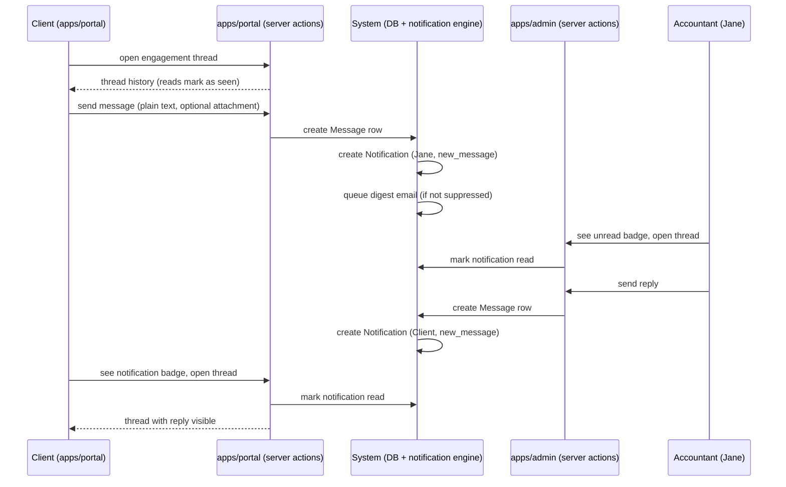

# Flow: Message Exchange

**Flow ID:** `flow-message-exchange`  
**One-line summary:** A client and accountant exchange plain-text messages within an engagement thread (or a general thread); both parties receive in-portal notifications; email digest provides fallback nudge.

**Status:** Phase 4 stub — covers Epic 005 (Messaging & Notifications) scope. Authored here for flow-gate completeness; to be refined during Epic 005 pre-planning.

---

## Actors

| Actor | Persona | Role in this flow |
|---|---|---|
| Client | `sarah-returning-client`, `martha-and-james-married-couple` | Sends and receives messages in engagement threads on `apps/portal`. |
| Accountant | `jane-accountant` | Sends and receives messages in engagement threads on `apps/admin`. May open general threads. |
| System | — | Persists messages, marks unread, triggers in-portal notifications, triggers email digest. |

---

## Preconditions

- An `Engagement` exists (for engagement-scoped threads).
- Both the client and accountant have authenticated sessions in their respective apps.
- A `Thread` record exists for the engagement (or the accountant creates a general thread per REQ-MSG-002).
- SQL Server Security Policies (ADR-005) ensure each party sees only their authorized threads.

---

## Steps — Engagement Thread: Client Sends Message

1. **[Client] Opens engagement message thread in `apps/portal`.**
   - Actor: CLIENT.
   - Action: Navigates to their engagement detail in `apps/portal`. Opens the Messages tab. Thread history loads.
   - REQ-MSG-001 — per-engagement thread with persistent history.
   - Observable outcome: Thread renders with prior messages (read). Unread messages marked.

2. **[Client] Composes and sends a plain-text message.**
   - Actor: CLIENT.
   - Action: Types a plain-text message. Optionally attaches a file. Sends.
   - REQ-MSG-003 — plain text only (no rich text, no markdown).
   - REQ-MSG-004 — file attachments are permitted.
   - Observable outcome: `Message` row created, linked to the `Thread`. Client sees their sent message in the thread.

3. **[System] Creates in-portal notification for accountant.**
   - Actor: System.
   - Action: Creates a `Notification` row for Jane: type `new_message`, linked to the engagement and thread.
   - REQ-MSG-013 — accountant notification type: new message.
   - REQ-MSG-007 — in-portal notification feed is primary channel.
   - Observable outcome: Jane's unread count badge increments in `apps/admin`.

4. **[System] Queues email digest nudge for accountant (if email not suppressed).**
   - Actor: System.
   - Action: Marks a pending digest entry for Jane. Digest job will send at most one email per day (REQ-MSG-009). Email body contains only "You have new activity in your portal" plus a login link.
   - REQ-MSG-008 — email is fallback nudge only, no content in body.
   - REQ-MSG-009 — once per day max.
   - REQ-MSG-010 — accountant may suppress entirely.
   - Observable outcome: Digest queued (or suppressed if Jane has turned email off).

5. **[Accountant] Opens thread in `apps/admin` and replies.**
   - Actor: Jane.
   - Action: Sees notification or unread badge. Opens engagement thread in `apps/admin`. Reads client's message (notification auto-marked read per REQ-MSG-015). Types reply and sends.
   - REQ-MSG-015 — notifications marked read when linked item viewed.
   - REQ-MSG-005 — unread indicators shown.
   - Observable outcome: Reply `Message` row created. Client receives in-portal notification: type `new_message`.

6. **[Client] Receives notification and reads reply.**
   - Actor: CLIENT.
   - Action: Notification badge shows in `apps/portal`. Client opens thread. Reply is visible. Notification marked read.
   - REQ-MSG-014 — client notification type: new message.
   - REQ-MSG-015 — marked read on view.
   - Observable outcome: Thread shows both messages, all marked read.

---

## Steps — General Thread (Accountant-Initiated)

1. **[Accountant] Opens a general thread with a client from `apps/admin`.**
   - Actor: Jane.
   - Action: Navigates to a client's record in `apps/admin`. Clicks "Open general message thread." A `Thread` row is created with `engagementId: null` and `type: general`.
   - REQ-MSG-002 — accountant may open general threads outside any specific engagement.
   - Observable outcome: General thread created. Client receives in-portal notification.

2. **[Both parties exchange messages]** — same pattern as engagement thread above.

---

## Branches

### B1 — Multi-participant engagement thread

- Both Martha and James have access to the engagement thread (via `EngagementParticipant`).
- Messages sent by either participant are visible to both.
- Notifications are sent to both participants and to the accountant.

### B2 — File attachment in message

- Sender attaches a file to a message.
- File is stored via the storage adapter (ADR-008, ADR-009) and a signed URL is generated for the recipient to download.
- The attachment appears in the message UI. REQ-MSG-004.

### B3 — Notification history

- Notifications older than 90 days are considered expired but are retained in the DB per REQ-MSG-016.
- The UI may or may not show notifications older than 90 days; the retention rule is for audit/recovery.

---

## Postconditions

- Both parties have sent and received at least one message.
- All messages persist in the `Thread` record.
- All in-portal notifications have been created and marked read.
- Thread remains accessible after engagement closes — archived, not deleted (REQ-MSG-006).

---

## Mermaid Diagram

---

## Linked Requirements

- REQ-MSG-001 — per-engagement threads
- REQ-MSG-002 — general threads (accountant-initiated)
- REQ-MSG-003 — plain text only
- REQ-MSG-004 — file attachments
- REQ-MSG-005 — unread indicators
- REQ-MSG-006 — threads archived on engagement close, not deleted
- REQ-MSG-007 — in-portal notification is primary channel
- REQ-MSG-008 — email nudge only
- REQ-MSG-009 — once-daily digest max
- REQ-MSG-010 — accountant can suppress email
- REQ-MSG-011 — client email fallback enabled by default
- REQ-MSG-013 — accountant notification types
- REQ-MSG-014 — client notification types
- REQ-MSG-015 — notifications marked read on view
- REQ-MSG-016 — 90-day notification retention
- REQ-MSG-017 — unread count badge in nav
