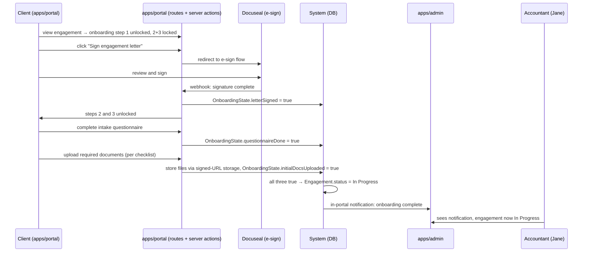

# Flow: Client Onboarding

**Flow ID:** `flow-onboarding`  
**One-line summary:** A newly accepted client completes the three-step onboarding gate — engagement letter e-sign, intake questionnaire, initial document upload — causing the engagement to transition from `New` to `In Progress`.

**Status:** Active — realizes **Phase 2** (the onboarding gate). Reconciled 2026-06-17 against the authored Phase-2 epics: **EPIC-005** (onboarding spine + engagement-letter e-sign gate — steps 1–2 of this flow), **EPIC-006** (intake questionnaire — step 3), **EPIC-007** (initial document upload — step 4), **EPIC-008** (completion → New→In Progress transition + accountant notification — steps 5–6). The earlier "Phase 3 stub / Epic 003" label was migrated legacy numbering and is corrected here. The e-signature integration (step 2) still depends on an architecture decision the architecture layer must ratify (no e-sign ADR yet; Docuseal appears only in the C4 model — see ROADMAP amendment 2026-06-17). Multi-participant signing (branch B1) is Phase 3.

---

## Actors

| Actor | Persona | Role in this flow |
|---|---|---|
| Client | `sarah-returning-client`, `tom-prospective-client` (post-signup), `martha-and-james-married-couple` | Completes the three onboarding steps. |
| Accountant | `jane-accountant` | Monitors onboarding progress; receives completion notification. |
| Docuseal (system) | — | Hosts the e-sign flow; fires webhook on signature completion. |
| System | — | Enforces the hard gate; transitions engagement status on completion. |

---

## Preconditions

- An `Engagement` exists with `status: New`.
- The CLIENT has signed in to `apps/portal` (per `flow-first-sign-in`).
- The accountant has defined an intake questionnaire template for this service type (REQ-ONBD-003, REQ-DASH-012).
- The accountant has defined the document checklist for this engagement (REQ-ONBD-004, REQ-FILE-008).
- An engagement letter template exists (system default or accountant-edited — REQ-IDNT-007).

---

## Steps

1. **[Client] Views onboarding progress in `apps/portal`.**
   - Actor: CLIENT.
   - Action: Logs in to `apps/portal`. Navigates to engagement detail. Sees three-step onboarding indicator: (1) Sign engagement letter, (2) Complete questionnaire, (3) Upload required documents. Step 2 and 3 are locked until step 1 is complete.
   - REQ-ONBD-001 — three sequential steps.
   - REQ-ONBD-002 — engagement letter must be signed before any other step is accessible. Hard gate.
   - Observable outcome: Onboarding progress rendered. Steps 2 and 3 visually locked.

2. **[Client] Signs the engagement letter via Docuseal.**
   - Actor: CLIENT.
   - Action: Clicks "Sign engagement letter." System redirects to Docuseal e-sign flow (self-hosted, per intake.md). Client reviews and signs the letter. Docuseal fires a webhook to the system confirming signature completion.
   - REQ-ONBD-002 — hard gate, Docuseal integration.
   - REQ-NFR-007 — Docuseal webhook callback confirms completion.
   - Observable outcome: `OnboardingState.letterSigned` → `true`. Steps 2 and 3 unlock. Client returns to `apps/portal`.

3. **[Client] Completes intake questionnaire.**
   - Actor: CLIENT.
   - Action: Clicks "Complete questionnaire." System presents the intake questionnaire templated for this service type. Client answers questions and submits.
   - REQ-ONBD-003 — questionnaire templated per service type, defined by accountant.
   - Observable outcome: `OnboardingState.questionnaireDone` → `true`. Step 3 remains.

4. **[Client] Uploads initial required documents.**
   - Actor: CLIENT.
   - Action: Clicks "Upload documents." System shows document checklist for this engagement. For each checklist item, client uploads the required file (e.g., W-2, prior year return). Any file type accepted.
   - REQ-ONBD-004 — upload per document checklist defined by accountant.
   - REQ-FILE-001 — client may upload files.
   - REQ-FILE-002 — any file type permitted.
   - REQ-FILE-003 — files stored via signed-URL object storage (ADR-008, ADR-009).
   - Observable outcome: Files stored. `OnboardingState.initialDocsUploaded` → `true` (when all checklist items are fulfilled).

5. **[System] Detects onboarding completion and transitions engagement.**
   - Actor: System.
   - Action: Evaluates `OnboardingState`: `letterSigned AND questionnaireDone AND initialDocsUploaded`. All three true → transitions engagement `status` from `New` to `In Progress`.
   - REQ-ONBD-005 — all three required.
   - REQ-ONBD-006 — completion triggers `New → In Progress` transition.
   - Observable outcome: `Engagement.status` updated to `In Progress`. In-portal notification created for accountant.

6. **[System] Notifies accountant.**
   - Actor: System.
   - Action: Creates in-portal notification for Jane: "Onboarding complete — [client name]."
   - REQ-ONBD-007 — accountant notified on onboarding completion.
   - REQ-MSG-013 — onboarding completed is a notification type for ACCOUNTANT.
   - Observable outcome: Jane sees notification in `apps/admin`.

---

## Branches

### B1 — Multi-participant engagement (Martha & James)

- If the engagement has multiple participants, both must sign the engagement letter before `letterSigned` is considered complete.
- Detail: whether Docuseal supports multi-party signing on one document or requires two separate signing events is to be resolved during Epic 003 design.
- Both participants see the onboarding progress in `apps/portal` via their `EngagementParticipant` link.

### B2 — Client abandons mid-onboarding

- Client completes step 1 but does not proceed to step 2.
- The hard gate prevents engagement from progressing.
- Accountant can see onboarding state in `apps/admin` (which steps are complete).
- Auto-reminder engine (REQ-FILE-012, REQ-MSG-018) can send nudges for overdue document requests at step 3.

### B3 — Docuseal webhook not received

- If the signature webhook fails to arrive (network issue, misconfigured URL), `OnboardingState.letterSigned` stays `false`.
- Client is stuck at step 1 even after signing.
- Mitigation: Docuseal webhooks include a retry mechanism; the system should implement idempotent webhook handling. If the webhook is lost, the accountant can manually mark the letter as signed from `apps/admin` (admin override — to be specified during Epic 003 design).

---

## Postconditions

- `OnboardingState` has all three fields `true`.
- `Engagement.status` is `In Progress`.
- All initial documents are stored in object storage under the engagement's folder structure.
- Accountant has received an in-portal notification.
- The engagement is now visible in Jane's pipeline as `In Progress`.

---

## Mermaid Diagram

---

## Linked Requirements

- REQ-ONBD-001 through REQ-ONBD-007
- REQ-AUTH-007, REQ-LIFE-012 (multi-participant)
- REQ-FILE-001, REQ-FILE-002, REQ-FILE-003, REQ-FILE-008
- REQ-MSG-013 (accountant notification)
- REQ-DASH-012 (questionnaire templates)
- REQ-NFR-007 (Docuseal webhook)
- REQ-IDNT-007 (engagement letter template)
