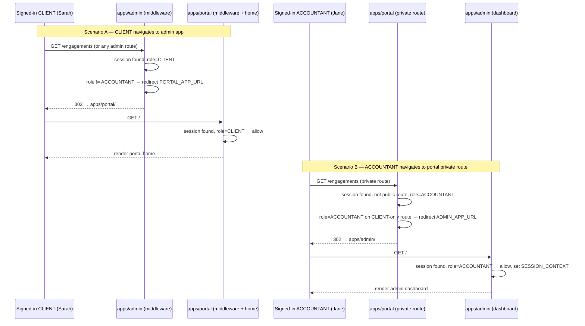

# Flow: Role-Based Cross-App Redirect

**Flow ID:** `flow-role-redirect`  
**One-line summary:** A signed-in user navigates to the wrong app for their role — middleware detects the mismatch and redirects them to their correct surface without showing any content from the wrong app.

**Status:** Foundational — covers Epic 001 scope (middleware role gates, cross-app redirect matrix from ADR-010).

---

## Actors

| Actor | Persona | Role in this flow |
|---|---|---|
| Signed-in CLIENT | `sarah-returning-client`, `martha-and-james-married-couple` | Navigates to `apps/admin` URL. Redirected to `apps/portal`. |
| Signed-in ACCOUNTANT | `jane-accountant` | Navigates to `apps/portal` CLIENT-only route. Redirected to `apps/admin`. |
| `apps/portal` middleware | System | Enforces role gate on the portal. |
| `apps/admin` middleware | System | Enforces role gate on the admin app. |

---

## Preconditions

- The user is authenticated — a valid Clerk session exists for the browser.
- The user's `publicMetadata.role` is set in the Clerk session (either `CLIENT` or `ACCOUNTANT`).
- Both apps are running and reachable (local dev: port 3000 and 3001; production: configured subdomains).
- `PORTAL_APP_URL` and `ADMIN_APP_URL` environment variables are set on both apps (ADR-010 § Middleware implementation).

---

## Steps — Scenario A: CLIENT navigates to `apps/admin`

1. **[CLIENT] Navigates to admin URL.**
   - Actor: Sarah (`sarah-returning-client`) or any signed-in CLIENT.
   - Action: Navigates to an `apps/admin` URL (e.g., `http://localhost:3001/` or `http://localhost:3001/engagements`). This may be via a mistyped URL, an old bookmark, or a link sent in error.
   - Observable outcome: HTTP request reaches `apps/admin`.

2. **[apps/admin middleware] Detects signed-in CLIENT.**
   - Actor: System (`apps/admin/middleware.ts`).
   - Action: Middleware runs Clerk session verification. Session found. Reads `session.claims.publicMetadata.role`. Role is `CLIENT`.
   - `apps/admin` expects `role === 'ACCOUNTANT'`. A CLIENT is the wrong role.
   - REQ-AUTH-010 — "Signed-in CLIENT → `apps/admin` (any route) → Redirect to `apps/portal/`."
   - ADR-010 § Role-based landing matrix.
   - Observable outcome: Middleware issues an HTTP redirect response (no admin UI is rendered, not even a flash).

3. **[CLIENT] Is redirected to `apps/portal`.**
   - Actor: Browser (following redirect).
   - Action: Browser follows the redirect to `process.env.PORTAL_APP_URL` (i.e., `apps/portal/`).
   - Observable outcome: Client lands on their `apps/portal` authenticated home.

4. **[apps/portal middleware] Validates CLIENT role on portal.**
   - Actor: System (`apps/portal/middleware.ts`).
   - Action: Middleware reads session. Role is `CLIENT`. This is the correct role for `apps/portal`. Allows the request.
   - Observable outcome: Portal renders the authenticated client home.

---

## Steps — Scenario B: ACCOUNTANT navigates to `apps/portal` CLIENT-only route

1. **[ACCOUNTANT] Navigates to a CLIENT-only route on `apps/portal`.**
   - Actor: Jane (`jane-accountant`).
   - Action: Navigates to a CLIENT-only route on `apps/portal` (e.g., `http://localhost:3000/engagements` or `http://localhost:3000/dashboard`). Public routes (services page, request form, sign-in) are not affected — see Branch B1.
   - Observable outcome: HTTP request reaches `apps/portal`.

2. **[apps/portal middleware] Detects signed-in ACCOUNTANT on CLIENT-only route.**
   - Actor: System (`apps/portal/middleware.ts`).
   - Action: Middleware runs Clerk session verification. Session found. Route is not on the public allow-list. Reads `session.claims.publicMetadata.role`. Role is `ACCOUNTANT`.
   - An ACCOUNTANT on a CLIENT-only private route is a cross-app misnavigation.
   - REQ-AUTH-010 — "Signed-in ACCOUNTANT → `apps/portal` CLIENT-only route → Redirect to `apps/admin/`."
   - ADR-010 § Role-based landing matrix.
   - Observable outcome: Middleware issues an HTTP redirect to `process.env.ADMIN_APP_URL`.

3. **[ACCOUNTANT] Is redirected to `apps/admin`.**
   - Actor: Browser (following redirect).
   - Action: Browser follows the redirect to `apps/admin/`.
   - Observable outcome: Jane lands on the `apps/admin` dashboard.

4. **[apps/admin middleware] Validates ACCOUNTANT role on admin.**
   - Actor: System (`apps/admin/middleware.ts`).
   - Action: Middleware reads session. Role is `ACCOUNTANT`. Allowed. `SESSION_CONTEXT` set.
   - Observable outcome: Admin dashboard renders normally.

---

## Branches

### B1 — ACCOUNTANT navigates to a PUBLIC route on `apps/portal`

- Jane visits `http://localhost:3000/` or `http://localhost:3000/services` (the public services page).
- `apps/portal` middleware: path is on the explicit public allow-list. Serve the route regardless of role.
- REQ-AUTH-010 (no restriction on public routes for any role).
- ADR-010: "Signed-in ACCOUNTANT → `apps/portal` public route → Serve the route. An accountant browsing her own public page is expected behavior."
- Observable outcome: Jane sees the public services page — **no redirect**. This is intentional: she may want to preview how the public page looks.

### B2 — Unauthenticated user navigates to `apps/admin`

- (Not a role mismatch; covered in `flow-first-sign-in` Branch B4 and ACCOUNTANT path Step 2.)
- `apps/admin` middleware: no session → redirect to `apps/admin/sign-in?redirect_url=<path>`.
- ADR-010: "Unauthenticated → `apps/admin` (any route) → Redirect to `apps/admin/sign-in` with `?redirect_url=<originally-requested>`."

### B3 — Unauthenticated user navigates to a private route on `apps/portal`

- (Covered in `flow-first-sign-in` Branch B4.)
- `apps/portal` middleware: no session, private route → redirect to `apps/portal/sign-in?redirect_url=<path>`.

### B4 — `PORTAL_APP_URL` or `ADMIN_APP_URL` env var not set at startup

- Middleware attempts to construct redirect URL from `process.env.PORTAL_APP_URL` (or `ADMIN_APP_URL`).
- If the env var is missing, the redirect would produce a broken or `undefined` URL.
- **Mitigation:** Each app's `/readyz` endpoint checks for required env vars at startup. A missing var fails the readiness check — the app never receives traffic in a healthy-container state if this is unset (per ADR-007 § Health endpoints and ADR-010 § Consequences).

### B5 — Sign-out cross-app behavior

- User signs out from either app (calls Clerk sign-out API).
- Clerk revokes the session globally.
- On the next request to either app, middleware finds no valid session and redirects to that app's sign-in.
- ADR-010 § Session sharing — "sign-out is global."
- Observable outcome: Both apps require re-authentication after sign-out from either one.

---

## Postconditions

**Scenario A (CLIENT → admin → portal redirect):**
- The CLIENT sees their `apps/portal` authenticated home.
- No admin content was served or rendered at any point.
- The redirect was seamless — a brief HTTP redirect with no flash of wrong-app UI.

**Scenario B (ACCOUNTANT → portal-private → admin redirect):**
- Jane sees the `apps/admin` dashboard.
- No CLIENT-only content was served or rendered.

---

## Mermaid Diagram

---

## Linked Requirements

- REQ-AUTH-001 — two authenticated roles: ACCOUNTANT and CLIENT
- REQ-AUTH-002 — ACCOUNTANT has full visibility (admin app context)
- REQ-AUTH-003 — CLIENT data isolation (SQL Server Security Policies)
- REQ-AUTH-010 — role-based cross-app redirect (full redirect matrix)
- REQ-NFR-001 — SQL Server Security Policies enforce data access
- REQ-NFR-004 — two-app architecture: `apps/portal` and `apps/admin`
