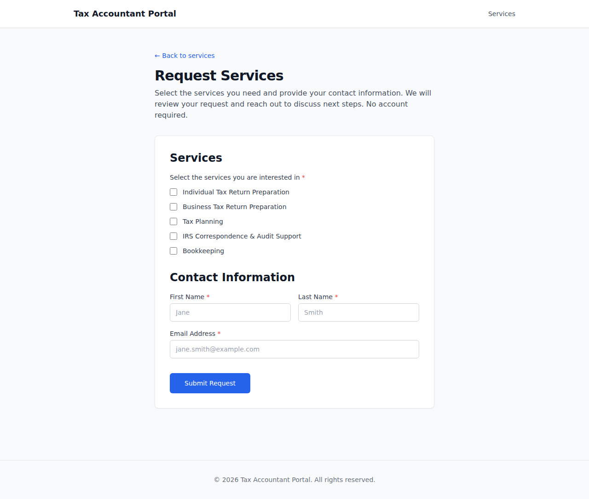
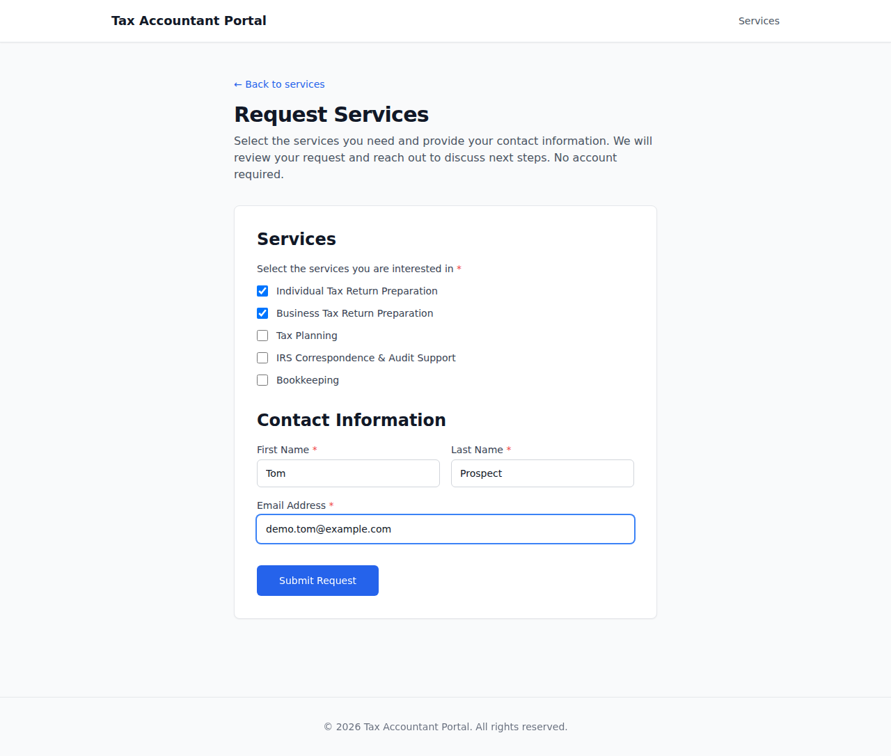
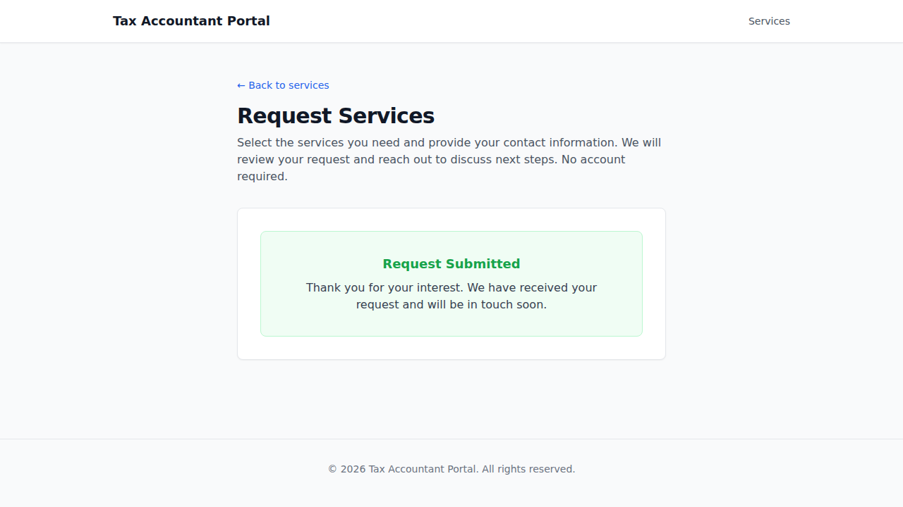

# EPIC-001 — Public front door (UI demo)

> An anonymous prospective client browses the accountant's active services and submits an engagement request
> — no account, no sign-in. AC-tagged screenshot walkthrough of the happy path, captured against the live
> docker-compose stack. See `.orchestration/DEMO-POLICY.md`.

- **Surface:** `apps/portal` (Client Portal)
- **Persona:** [Tom — prospective client](../../../.planning/personas/tom-prospective-client.md)
- **Flow:** [engagement-request](../../../.planning/flows/flow-engagement-request.md) (anonymous submission path)
- **Epic:** [EPIC-001](../../../.planning/EPIC-001-public-front-door.md) · **Shipped:** PR #35 (`f7f6c9d`)
- **Regenerate:** `docker compose up -d` → `pnpm db:migrate` → `pnpm db:seed` → `pnpm --filter portal e2e:demo`

## 1. Anonymous services page  [AC-DOOR-001-01]

Tom reaches the public services page with no account and no sign-in — the active services are listed and the
page states "No account required."

## 2. Engagement request form  [AC-DOOR-003-01]

The request form presents the active services as a selectable **checklist** plus basic contact fields — no
freeform "describe your need" box, no service-specific sub-questions.

## 3. Select services + provide contact info  [AC-DOOR-004-01]

Tom selects one or more services and enters his name and email.

## 4. Submit → pending request created  [AC-DOOR-004-03]

Submitting creates an engagement request in a **pending (awaiting-review)** state and shows the confirmation —
still no account created.

---

_Captured by `apps/portal/e2e/demo/engagement-request.demo.spec.ts` (`@demo`, excluded from the e2e gate).
Non-gating evidence — the e2e/acceptance gates are the gates._
