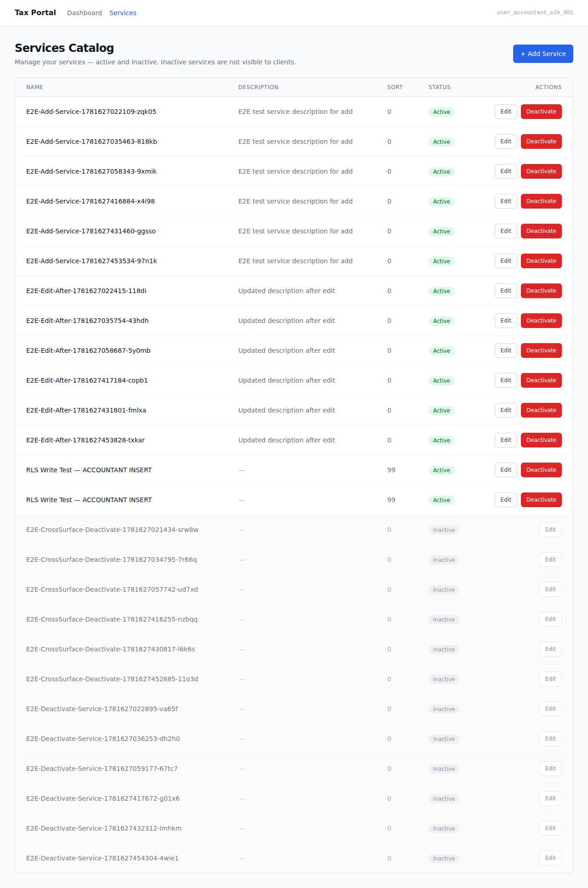
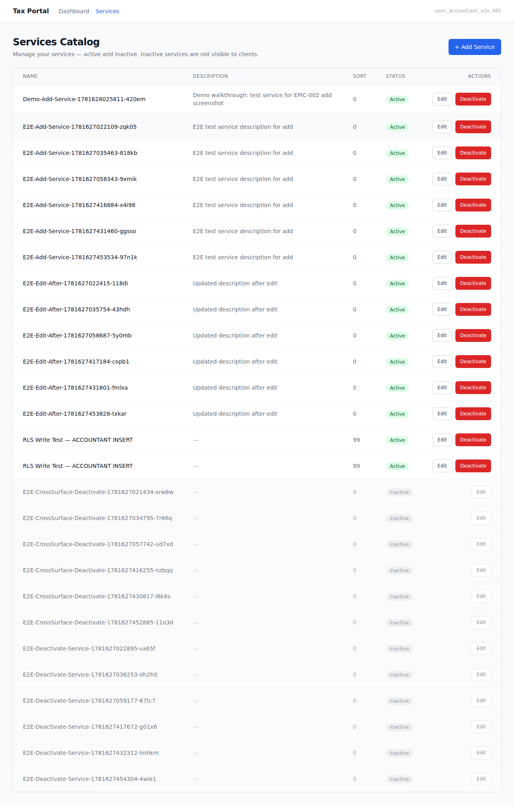
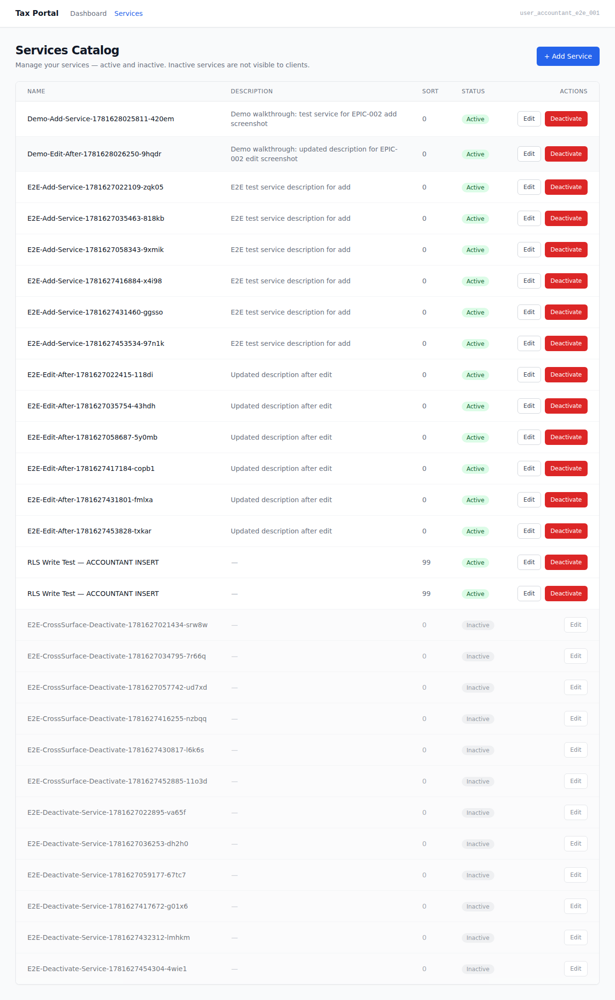
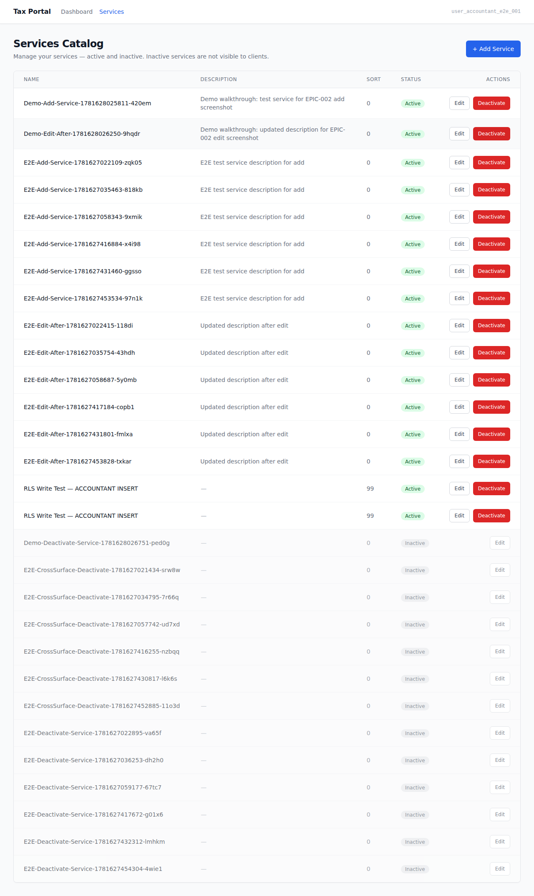

# EPIC-002 — Services Catalog management (UI demo)

> Jane-accountant manages the services catalog: she views the list, adds a new service, edits
> its details, and deactivates it — all on the authenticated admin surface. AC-tagged screenshot
> walkthrough captured against the live docker-compose stack (AUTH_PROVIDER=mock).
> See `.orchestration/DEMO-POLICY.md`.

- **Surface:** `apps/admin` (Tax Portal — accountant-facing)
- **Persona:** [Jane — accountant](../../../.planning/personas/jane-accountant.md)
- **Flow:** [flow-engagement-request](../../../.planning/flows/flow-engagement-request.md)
- **Epic:** [EPIC-002](../../../.planning/EPIC-002-services-catalog.md)
- **Regenerate:** `docker compose up -d` → `pnpm db:migrate` → `pnpm db:seed` → `ADMIN_BASE_URL=http://localhost:13001 ADMIN_PORT=13001 pnpm --filter admin e2e:demo`

---

## 01. Services Catalog list  [AC-DASH-010-01]

Jane (ACCOUNTANT) is signed in and navigates to admin `/services`. The Services Catalog management
screen is rendered — the heading "Services Catalog" is visible, proving the authenticated admin
surface is served without redirect.

## 02. Add a new service  [AC-DOOR-002-01]

Jane clicks "Add new service", fills in the service name and description, and submits the form.
The add form closes and the new service row appears in the catalog list with Active status — proving
the add path is functional end-to-end.

## 03. Edit a service  [AC-DOOR-002-02]

Jane clicks the "Edit" button on a service, updates the name and description in the edit form, and
saves the changes. The updated row is visible in the catalog list — proving the edit path persists
and reflects the new details.

## 04. Deactivate a service — inactive state  [AC-DOOR-002-03]

Jane clicks the "Deactivate" button and confirms the dialog. The service row shows the inactive
badge (data-testid="inactive-badge") — proving the deactivation path fires and the inactive state
is surfaced to the accountant.

---

_Captured by `apps/admin/e2e/demo/services-catalog.demo.spec.ts` — `@demo`, excluded from the
e2e gate. Non-gating evidence — the e2e/acceptance gates (TASK-002-004) are the gates._
