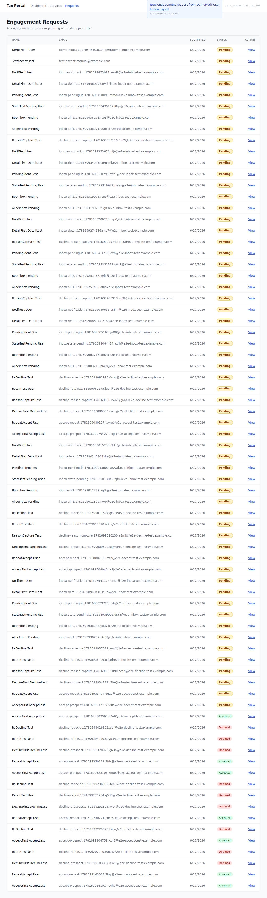
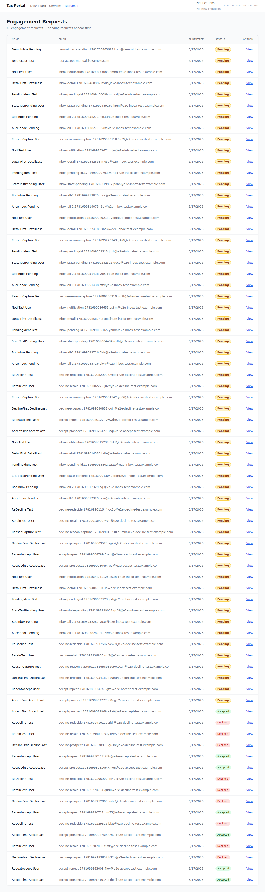
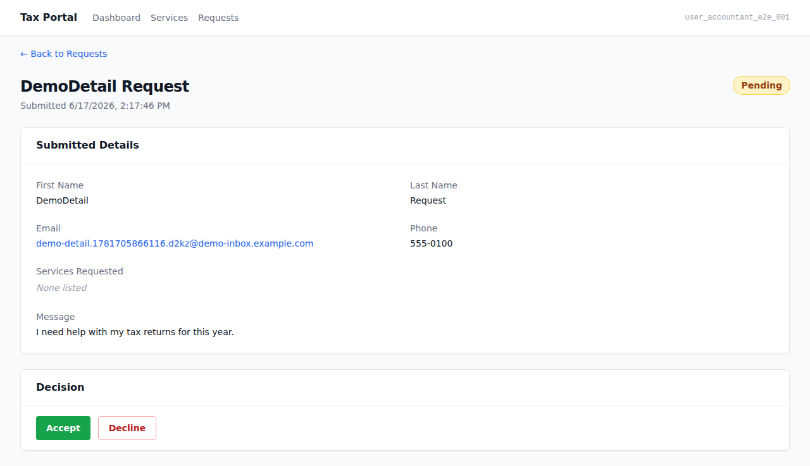
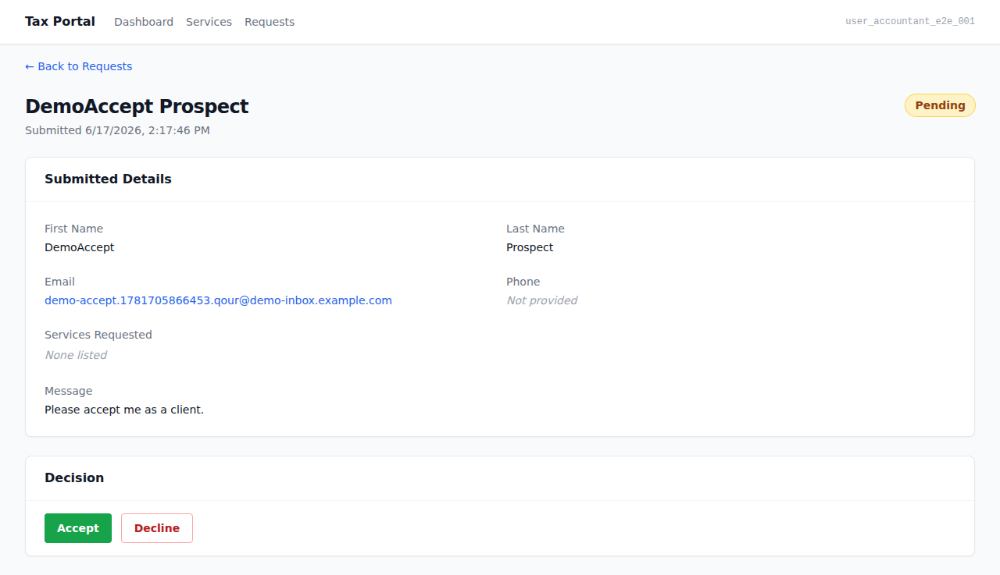
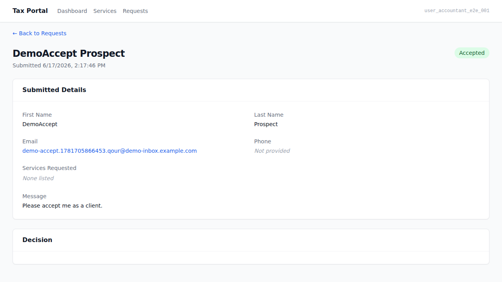
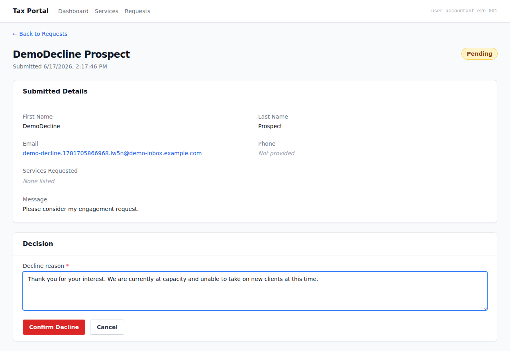
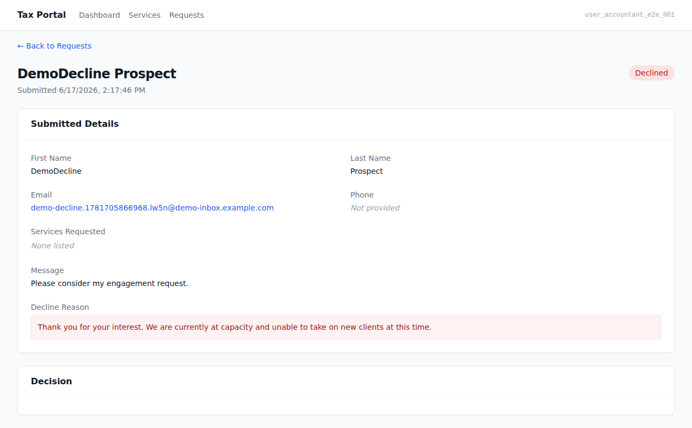

# EPIC-003 — Accountant request inbox (UI demo)

> Jane-accountant is notified of a new engagement request, opens the inbox, views the submitted
> details, and makes a decision — either accepting (issuing an invitation) or declining (capturing
> and emailing a reason). AC-tagged screenshot walkthrough captured against the live
> docker-compose stack (AUTH_PROVIDER=mock). See `.orchestration/DEMO-POLICY.md`.

- **Surface:** `apps/admin` (Tax Portal — accountant-facing)
- **Persona:** [Jane — accountant](../../../.planning/personas/jane-accountant.md)
- **Flows:** [flow-engagement-request](../../../.planning/flows/flow-engagement-request.md), [flow-first-sign-in](../../../.planning/flows/flow-first-sign-in.md)
- **Epic:** [EPIC-003](../../../.planning/EPIC-003-accountant-request-inbox.md)
- **Regenerate:** `docker compose up -d` → `pnpm db:migrate` → `pnpm db:seed` → `ADMIN_BASE_URL=http://localhost:13001 ADMIN_PORT=13001 pnpm --filter admin e2e:demo`

---

## 01. Notification identifies new request and leads jane to it  [AC-DOOR-005-02, AC-MSG-013-01]

Jane has an in-portal notification for a new engagement request. The notifications indicator
is visible on the inbox page; clicking the notification link navigates her directly to the
request's detail page — proving the notification both identifies the new request and leads
the accountant to review it. Delivered to the accountant only (not clients or anonymous visitors).

## 02. Inbox list — all requests, states distinguishable, pending identifiable  [AC-DASH-011-01, AC-DASH-011-02, AC-DASH-011-03]

Jane opens the admin `/requests` inbox and sees all engagement requests. Each row carries a
status badge (`data-status` attribute) so states are distinguishable — "Pending", "Accepted",
"Declined". Pending rows have `data-status="pending"`, making them identifiable at a glance.

## 03. Request detail — submitted details visible  [AC-DOOR-006-01]

Jane clicks the View link for a pending request. The detail page shows all submitted details:
prospect name, email address, phone, and message. The status badge shows "Pending", confirming
she is looking at a request that still needs a decision.

## 04. Accept affordance — idle decision panel with Accept and Decline buttons  [AC-DOOR-006-02]

On the pending request detail page, the decision panel is shown with both Accept and Decline
buttons — proving the accountant has the affordance to make a decision (AC-DOOR-006-02).

## 05. Accepted state — invitation issued; decision panel removed  [AC-DOOR-006-02, AC-DOOR-006-05, AC-DOOR-007-01, AC-DOOR-007-04]

After clicking Accept, the page re-renders (Next.js server action + `revalidatePath`) with the
status badge showing "Accepted". The decision panel is gone — the request is no longer decidable
(AC-DOOR-006-05). An invitation email is issued to the prospect's contact address via the
`packages/auth` seam, tied to the accepted request (AC-DOOR-007-01, AC-DOOR-007-04), and
captured by Mailhog. The invitation directs the recipient to create their own portal account.

## 06. Decline form — free-text reason textarea  [AC-DOOR-008-01]

After clicking Decline, the decision panel transitions to the decline form — a textarea where
jane can write a brief free-text reason message before confirming the decline. The submit button
is disabled until a reason is entered.

## 07. Declined state — reason retained; decision panel removed  [AC-DOOR-006-03, AC-DOOR-006-05, AC-DOOR-008-04]

After submitting the decline reason, the page re-renders with the status badge showing "Declined".
The decline reason is retained and displayed on the detail page — attached to the declined request
for the accountant's later reference (AC-DOOR-008-04). The decision panel is gone (AC-DOOR-006-05).
The reason is also emailed to the prospect's contact address via Mailhog (AC-DOOR-008-02).

---

_Captured by `apps/admin/e2e/demo/request-inbox.demo.spec.ts` — `@demo`, excluded from the
e2e gate. Non-gating evidence — the e2e/acceptance gates (TASK-003-006) are the gates._
