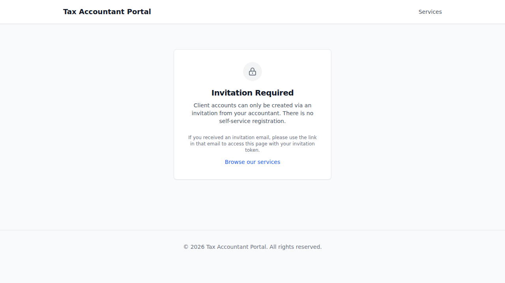
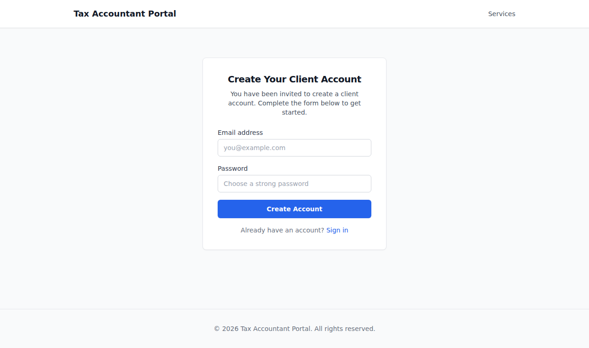
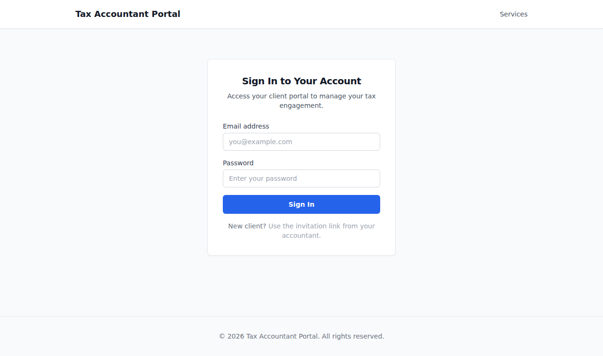
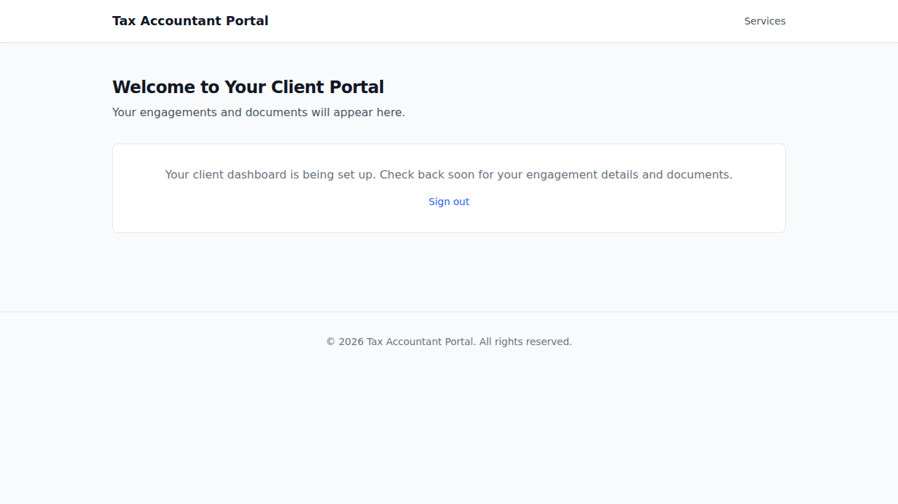
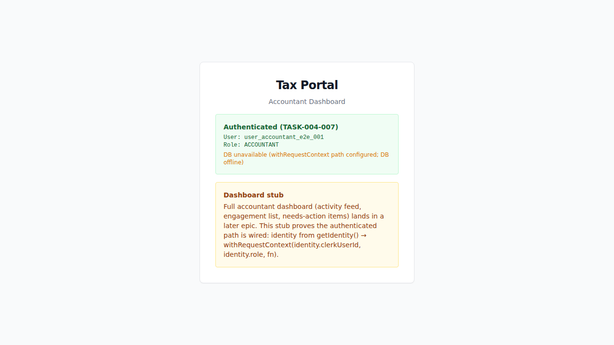
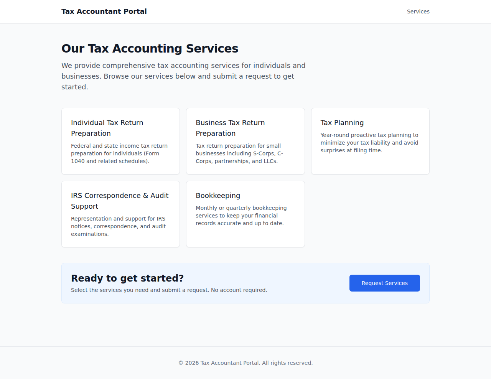

# EPIC-004 — Authentication & the two-role model (UI demo)

> The identity spine: an invited client creates a portal account with no 2FA, and the accountant
> accesses her Tax Portal dashboard — both authenticated via the mock provider against the live
> docker-compose stack. The role-redirect journey then shows the cross-app ADR-010 enforcement.
> AC-tagged screenshot walkthrough. See `.orchestration/DEMO-POLICY.md`.

- **Surfaces:** `apps/portal` (Client Portal) + `apps/admin` (Tax Portal)
- **Personas:**
  - [Tom — prospective client](../../../.planning/personas/tom-prospective-client.md) (sections A + C portal-landed)
  - [Jane — accountant](../../../.planning/personas/jane-accountant.md) (sections B + C admin-landed)
- **Flows:**
  - [flow-first-sign-in](../../../.planning/flows/flow-first-sign-in.md) — first sign-in, invitation, no 2FA (both paths)
  - [flow-role-redirect](../../../.planning/flows/flow-role-redirect.md) — cross-app bounce matrix
- **Epic:** [EPIC-004](../../../.planning/EPIC-004-auth-two-role-model.md) · **Shipped:** PR #38
- **Regenerate:** `docker compose up -d` → `pnpm db:migrate` → `pnpm db:seed` → `pnpm --filter portal e2e:demo` + `pnpm --filter admin e2e:demo`

---

## 01. Invitation required — no self-registration  [AC-AUTH-006-02]

Tom navigates to `/sign-up` with no ticket. The portal shows an "invitation required" state — no
sign-up form is rendered. Proves that account creation requires an accountant-issued invitation.

## 02. Sign-up form via invitation ticket  [AC-AUTH-006-01]

Tom visits `/sign-up?ticket=<fixture>` — the invitation ticket renders the sign-up form (email +
password fields, submit button). No OTP or 2FA step is present (deferred this slice).

## 03. Sign-in — email + password only, no 2FA  [AC-AUTH-005-02]

Tom reaches `/sign-in`. Only email and password fields are shown — no second-factor selector, no
OTP input. Sign-in completes without a 2FA challenge (2FA deferred this slice).

## 04. Authenticated CLIENT lands on portal dashboard  [AC-AUTH-005-02]

After sign-in, Tom's CLIENT session is established and he lands on `/dashboard` — the portal
client dashboard panel is visible ("Welcome to Your Client Portal"). No 2FA challenge.

## 05. Accountant (Jane) lands on authenticated Tax Portal dashboard  [AC-AUTH-001-03]

Jane's ACCOUNTANT session is established via the mock provider. She navigates to the admin root —
the authenticated Tax Portal surface renders ("Tax Portal" / "Accountant Dashboard"), with the
identity panel showing her user id and role. Middleware passed her through; no 2FA challenge.

## 06. CLIENT bounced from admin URL — lands on portal  [AC-AUTH-010-01]

Tom (CLIENT) navigates to the admin app root. The ADR-010 middleware fires: the CLIENT is
redirected away from the admin surface and lands on the portal origin. No admin content is served.

## 07. ACCOUNTANT bounced from portal CLIENT-only route — lands on admin  [AC-AUTH-010-02]

Jane (ACCOUNTANT) navigates to portal `/dashboard` (a CLIENT-only route). The portal middleware
fires: she is redirected to the admin origin. The admin surface ("Tax Portal") is visible on
the landed page.

## 08. ACCOUNTANT on portal public route — served, not redirected  [AC-AUTH-010-03]

Jane (ACCOUNTANT) navigates to portal `/services` (a public route in the portal allow-list). She
is served the page — no redirect to admin fires. This is the intentional no-bounce case (ADR-010
§1 allow-list).

---

_Captured by `apps/portal/e2e/demo/identity-spine.demo.spec.ts` (shots 01–04 + 06) and
`apps/admin/e2e/demo/identity-spine.demo.spec.ts` (shots 05 + 07–08) — `@demo`, excluded from
the e2e gate. Non-gating evidence — the e2e/acceptance gates are the gates._

> **Capture caveat (2026-06-16, Conductor close-out).** Two shot pairs are byte-identical:
> **05≡07** is expected — shot 07 (accountant bounced from the portal) redirects to the same
> authenticated admin dashboard shown in shot 05, so the landed surface is identical. **06≡08 is
> a suspected stale/duplicate capture** — shot 06 (portal spec, CLIENT bounced from admin) and
> shot 08 (admin spec, accountant served portal `/services`) are different specs/routes/personas
> yet rendered identical bytes. The underlying behavior is independently proven by the AC-AUTH-010
> e2e suite (gating); this is a **demo-artifact re-verify item**, not a behavior defect. Re-capture
> shots 06 + 08 with `pnpm --filter portal/admin e2e:demo` once the local docker stack bootstrap is
> restored (carried infra follow-up). Demos are non-gating per DEMO-POLICY; this does not affect the
> delivered AC.
