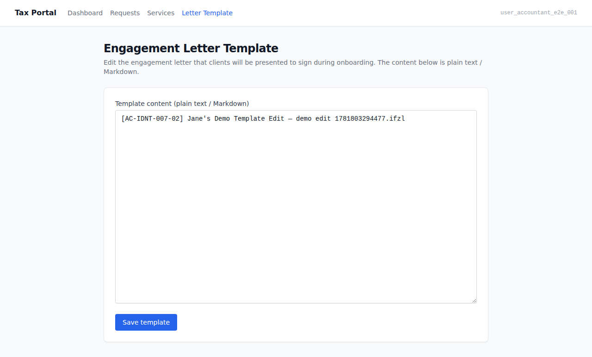
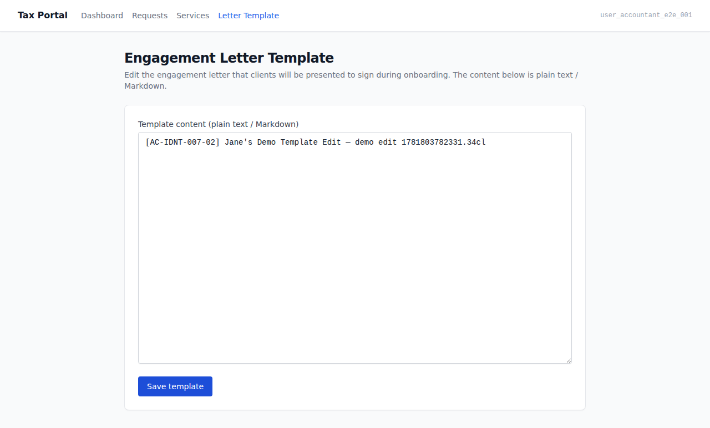
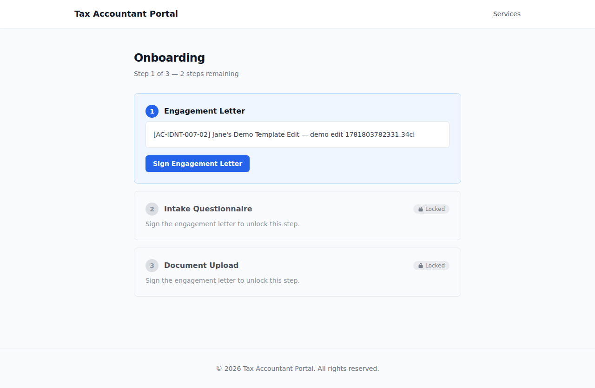
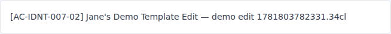
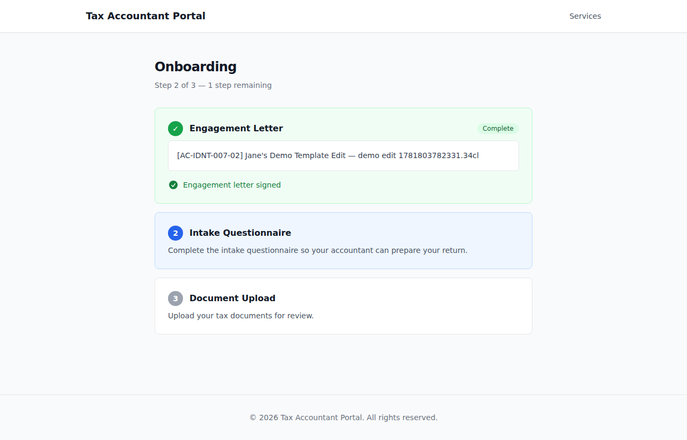

# EPIC-005 — Onboarding spine + engagement-letter e-sign gate (UI demo)

> Jane-accountant edits the engagement-letter template in the Tax Portal; a newly
> accepted client signs in, sees the three-step onboarding sequence (steps 2+3 locked),
> sees Jane's template as the letter to sign, signs it, and watches steps 2+3 unlock.
> AC-tagged screenshot walkthrough captured against the live docker-compose stack
> (AUTH_PROVIDER=mock, ESIGN_PROVIDER=mock). See `.orchestration/DEMO-POLICY.md`.

- **Surfaces:** `apps/admin` (Tax Portal — accountant-facing) + `apps/portal` (Client Portal — client-facing)
- **Personas:**
  - [Jane — accountant](../../../.planning/personas/jane-accountant.md)
  - [Tom — prospective client (post-signup)](../../../.planning/personas/tom-prospective-client.md)
- **Flows:**
  - [flow-onboarding](../../../.planning/flows/flow-onboarding.md)
  - [flow-first-sign-in](../../../.planning/flows/flow-first-sign-in.md)
- **Epic:** [EPIC-005](../../../.planning/EPIC-005-onboarding-spine-engagement-letter.md)
- **Regenerate:**
  ```
  docker compose up -d
  pnpm db:migrate
  pnpm db:seed
  ADMIN_BASE_URL=http://localhost:13001 ADMIN_PORT=13001 pnpm --filter admin e2e:demo
  pnpm --filter portal e2e:demo
  ```

---

## 01. System-provided default template present out of the box  [AC-IDNT-007-01]

Jane opens the engagement-letter template setting in the Tax Portal (`/settings/letter-template`).
A system-provided default template is already present — the `template-content` textarea is
non-empty. No manual authoring was required to get started.

**AC covered:** AC-IDNT-007-01 — a system-provided default engagement-letter template exists
without the accountant authoring one from scratch.

**Surface:** `apps/admin` — `apps/admin/e2e/demo/letter-template.demo.spec.ts`



---

## 02. Accountant edits the template and the edit persists  [AC-IDNT-007-02]

Jane edits the template content and clicks "Save template". A success banner confirms the save.
After navigating away and back, the edited content is still present — proving the edit persists
as the current template.

**AC covered:** AC-IDNT-007-02 — the accountant can edit the template's content herself; the
edited content is retained as the current template.

**Surface:** `apps/admin` — `apps/admin/e2e/demo/letter-template.demo.spec.ts`



---

## 03. Three ordered steps with steps 2+3 visibly locked  [AC-ONBD-001-01]

The post-signup client opens `/onboarding`. They see exactly three steps in fixed order:
(1) Sign the engagement letter, (2) Complete the questionnaire, (3) Upload documents.
Steps 2 and 3 carry lock badges — the letter has not yet been signed, so the gate is closed.

**AC covered:**
- AC-ONBD-001-01 — onboarding presents exactly three steps in order
- AC-ONBD-001-02 (UI affordance) — later steps are visibly locked until their predecessor is done

**Surface:** `apps/portal` — `apps/portal/e2e/demo/onboarding.demo.spec.ts`



---

## 04. Position indicator shows "Step 1 of 3" and remaining count  [AC-ONBD-001-03]

The onboarding position indicator shows the client's current step ("Step 1 of 3") and the
number of remaining steps — so they can see where they are in the sequence and how much is left.

**AC covered:** AC-ONBD-001-03 — the client can see their current position in the sequence
and which steps remain.

**Surface:** `apps/portal` — `apps/portal/e2e/demo/onboarding.demo.spec.ts`


---

## 05. Engagement-letter step shows the accountant's template content  [AC-IDNT-007-03]

The engagement-letter step in onboarding renders the `letter-content` area, populated with the
accountant's current template — whichever content Jane last saved. The client sees the actual
letter they are about to sign, not a placeholder.

**AC covered:** AC-IDNT-007-03 — the accountant's edited template is what the client is
presented to sign in onboarding.

**Surface:** `apps/portal` — `apps/portal/e2e/demo/onboarding.demo.spec.ts`



---

## 06. Sign-letter button visible — sign affordance present  [AC-ONBD-002-03]

The "Sign Engagement Letter" button is visible on the engagement-letter step. This is the
affordance that drives the e-sign action through the `ESignatureProvider` PORT. Pre-sign state:
step 1 accessible, steps 2+3 locked.

**AC covered:** AC-ONBD-002-03 (sign affordance visible before signing)

**Surface:** `apps/portal` — `apps/portal/e2e/demo/onboarding.demo.spec.ts`


---

## 07. After signing: steps 2+3 unlock; step 1 marked done  [AC-ONBD-002-03, AC-ONBD-002-04]

After the client clicks "Sign Engagement Letter", the page re-renders: step 1 (`data-done="true"`)
shows the letter is recorded against the engagement; the lock badges disappear from steps 2 and 3,
which become accessible (`data-accessible="true"`). The onboarding gate has opened.

**AC covered:**
- AC-ONBD-002-03 — once the letter is e-signed, the subsequent steps become accessible
- AC-ONBD-002-04 — the signed engagement letter is recorded against the engagement as evidence
  the gate was satisfied (observable: step 1 `data-done="true"`)

**Surface:** `apps/portal` — `apps/portal/e2e/demo/onboarding.demo.spec.ts`



---

_Captured by:_
- `apps/admin/e2e/demo/letter-template.demo.spec.ts` (`@demo`, admin surface)
- `apps/portal/e2e/demo/onboarding.demo.spec.ts` (`@demo`, portal surface)

_Both specs are excluded from the e2e gate (`e2e:run` uses `--grep-invert @demo`). Non-gating
evidence — the e2e/acceptance gates (TASK-005-007) are the delivery gates._
