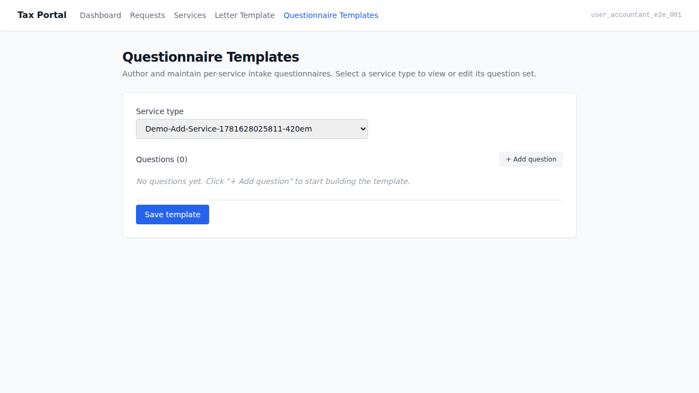
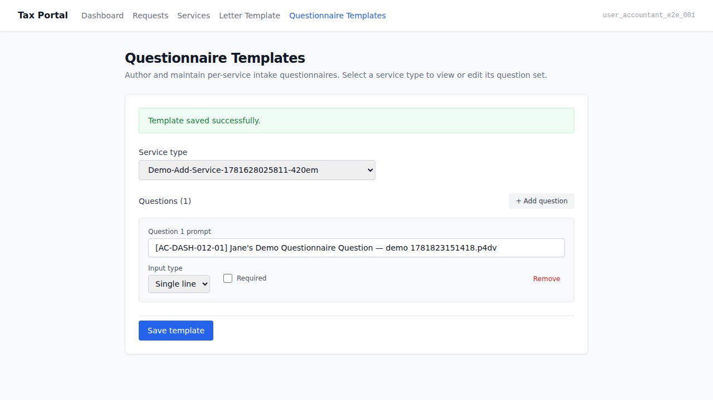
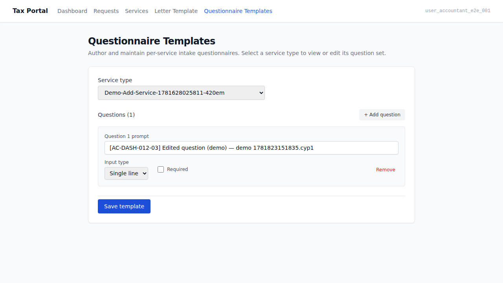
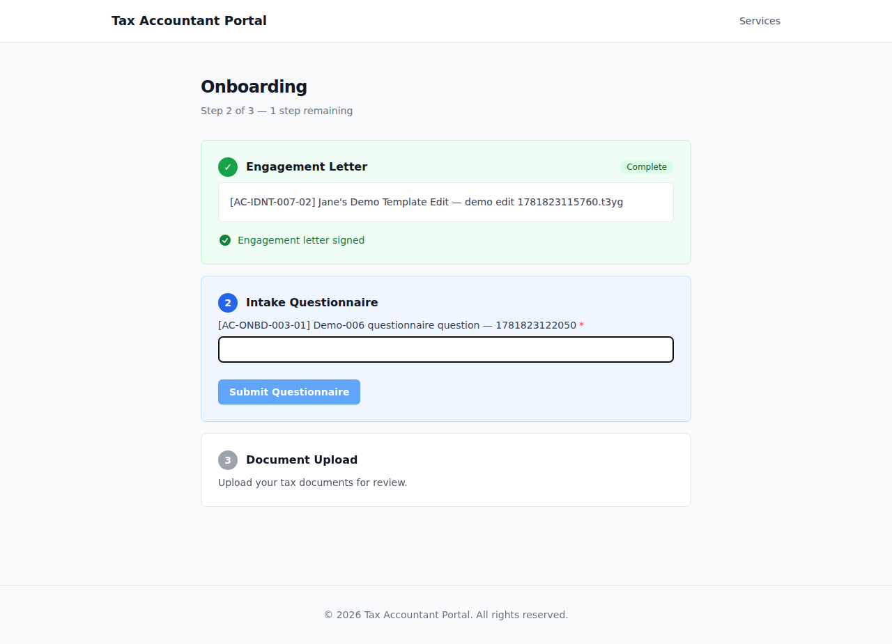
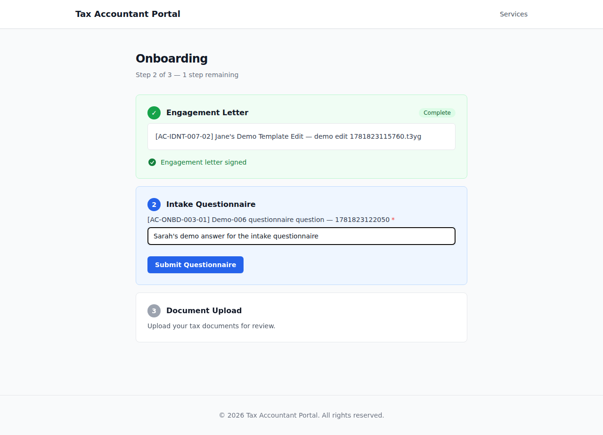
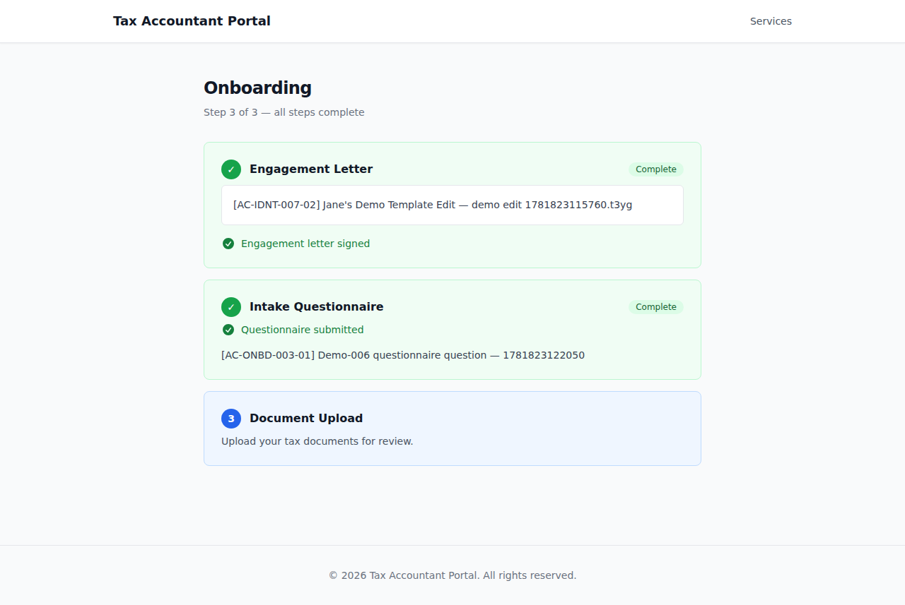

# EPIC-006 — Intake questionnaire (UI demo)

> Jane-accountant picks a service type and authors a questionnaire template in the Tax Portal.
> Sarah (a returning client who has already signed her engagement letter) reaches onboarding
> step 2, is shown the questionnaire matching her engagement's service type, fills it in,
> submits it, and the step is marked satisfied.
> AC-tagged screenshot walkthrough captured against the live docker-compose stack
> (AUTH_PROVIDER=mock, ESIGN_PROVIDER=mock). See `.orchestration/DEMO-POLICY.md`.

- **Surfaces:** `apps/admin` (Tax Portal — accountant-facing) + `apps/portal` (Client Portal — client-facing)
- **Personas:**
  - [Jane — accountant](../../../.planning/personas/jane-accountant.md)
  - [Sarah — returning client](../../../.planning/personas/sarah-returning-client.md)
- **Flows:**
  - [flow-onboarding](../../../.planning/flows/flow-onboarding.md)
- **Epic:** [EPIC-006](../../../.planning/EPIC-006-intake-questionnaire.md)
- **Regenerate:**
  ```
  docker compose up -d
  pnpm db:migrate
  pnpm db:seed
  ADMIN_BASE_URL=http://localhost:13001 ADMIN_PORT=13001 pnpm --filter admin e2e:demo
  pnpm --filter portal e2e:demo
  ```

---

## 01. Service type picker — accountant selects a service type  [AC-DASH-012-02]

Jane opens the questionnaire-template settings page (`/settings/questionnaire-templates`).
The service type picker is visible and a service type is already selected. The questionnaire
editor is loaded for the selected service type — ready for authoring.

**AC covered:** AC-DASH-012-02 — the accountant can associate a questionnaire template with
a specific service type via the picker.

**Surface:** `apps/admin` — `apps/admin/e2e/demo/questionnaire-template.demo.spec.ts`



---

## 02. Accountant authors questions and saves  [AC-DASH-012-01]

Jane adds a question with an identifiable prompt and clicks "Save template". A success banner
confirms the save — the new intake questionnaire template is saved and available.

**AC covered:** AC-DASH-012-01 — the accountant creates an intake questionnaire template;
the template is saved and available.

**Surface:** `apps/admin` — `apps/admin/e2e/demo/questionnaire-template.demo.spec.ts`



---

## 03. Accountant edits an existing template and the edit persists  [AC-DASH-012-03]

Jane edits the question prompt, saves, navigates away and back. The edited template is retained
as the current template for that service type — confirming persistence after navigate-away.

**AC covered:** AC-DASH-012-03 — the edited template is retained as the current template for
its service type.

**Surface:** `apps/admin` — `apps/admin/e2e/demo/questionnaire-template.demo.spec.ts`



---

## 04. Post-letter-gate onboarding — questionnaire step unlocked  [AC-ONBD-003-01]

Sarah (who has already signed her engagement letter) opens `/onboarding`. Onboarding step 2
(Intake questionnaire) is accessible (`data-accessible="true"`). She clicks into it and the
questionnaire form is shown — containing the question authored by Jane for her service type.

**AC covered:** AC-ONBD-003-01 — the post-gate client is shown the questionnaire for their
engagement's service type (the authored template content appears in the form).

**Surface:** `apps/portal` — `apps/portal/e2e/demo/questionnaire.demo.spec.ts`



---

## 05. Client fills in the questionnaire — before submit (unsatisfied)  [AC-ONBD-003-03]

Sarah fills in the required question field. The `data-questionnaire-submitted="false"` attribute
on the form confirms the step is not yet satisfied. The Submit button is visible and enabled
(all required fields filled).

**AC covered:** AC-ONBD-003-03 (pre-submit) — the step is not satisfied until the client
submits their completed questionnaire.

**Surface:** `apps/portal` — `apps/portal/e2e/demo/questionnaire.demo.spec.ts`



---

## 06. Step satisfied after submit  [AC-ONBD-003-03]

After Sarah clicks Submit, the server processes the questionnaire and the page re-renders.
The `data-questionnaire-submitted="true"` attribute is set; a confirmation message appears;
the onboarding step is marked done (`data-done="true"`). The questionnaire gate is satisfied.

**AC covered:** AC-ONBD-003-03 (post-submit) — once the client submits, the step is satisfied.

**Surface:** `apps/portal` — `apps/portal/e2e/demo/questionnaire.demo.spec.ts`



---

_Captured by:_
- `apps/admin/e2e/demo/questionnaire-template.demo.spec.ts` (`@demo`, admin surface)
- `apps/portal/e2e/demo/questionnaire.demo.spec.ts` (`@demo`, portal surface)

_Both specs are excluded from the e2e gate (`e2e:run` uses `--grep-invert @demo`). Non-gating
evidence — the e2e/acceptance gates (TASK-006-006) are the delivery gates._
