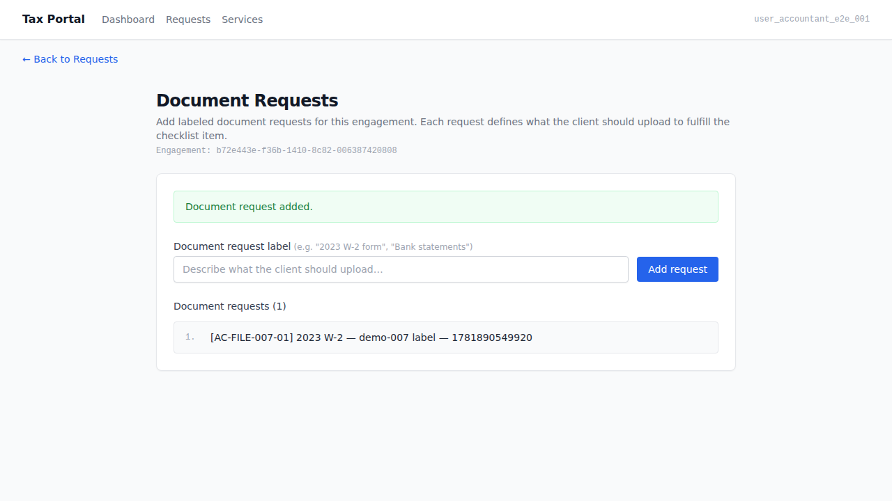
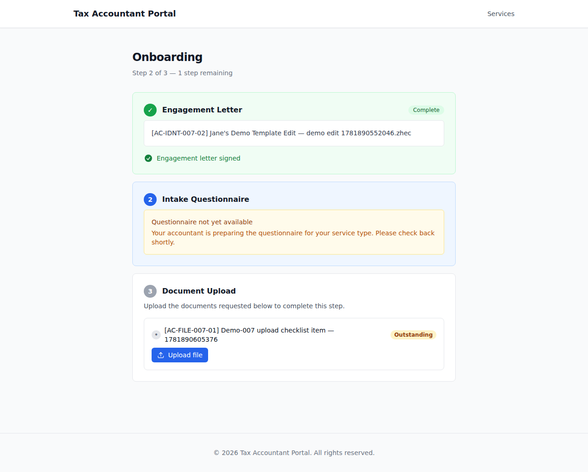
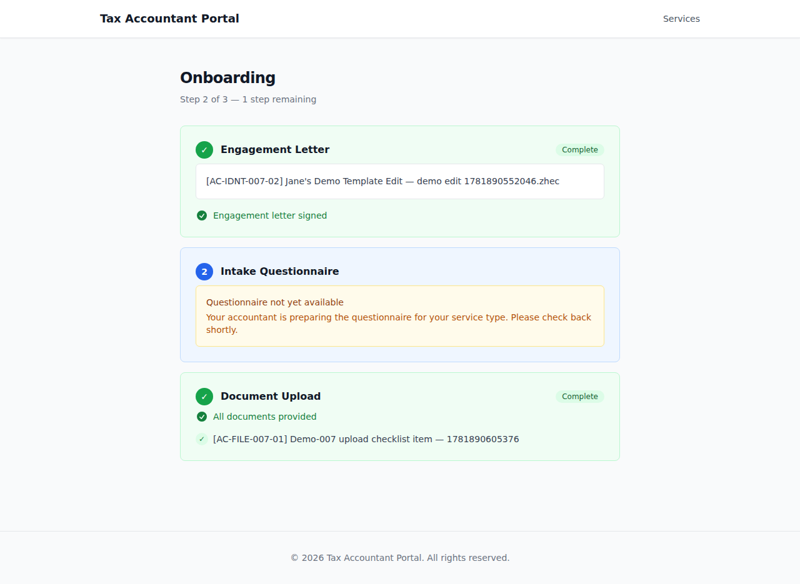
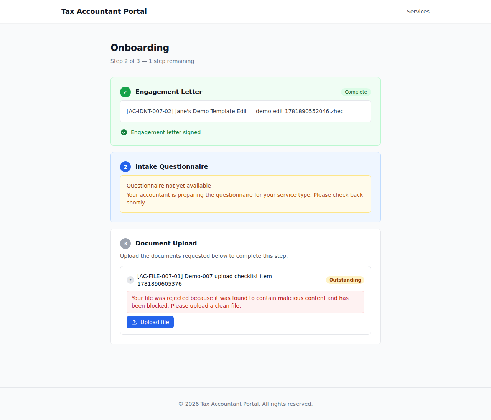

# EPIC-007 — Initial document upload (UI demo)

> Jane-accountant creates a labeled document request for an engagement in the Tax Portal.
> Sarah (a returning client who has already signed her engagement letter) reaches onboarding
> step 3, is shown the document checklist with outstanding items, uploads a clean document
> to fulfill the request (item transitions to Provided), and then attempts to upload a
> malicious file (EICAR) which is rejected by the mock malware scanner — the item remains
> Outstanding and the rejection message appears.
> AC-tagged screenshot walkthrough captured against the live docker-compose stack
> (AUTH_PROVIDER=mock, ESIGN_PROVIDER=mock, MALWARE_SCAN_PROVIDER=mock). See `.orchestration/DEMO-POLICY.md`.

- **Surfaces:** `apps/admin` (Tax Portal — accountant-facing) + `apps/portal` (Client Portal — client-facing)
- **Personas:**
  - [Jane — accountant](../../../.planning/personas/jane-accountant.md)
  - [Sarah — returning client](../../../.planning/personas/sarah-returning-client.md)
- **Flows:**
  - [flow-onboarding](../../../.planning/flows/flow-onboarding.md)
  - [flow-file-exchange](../../../.planning/flows/flow-file-exchange.md)
- **Epic:** [EPIC-007](../../../.planning/EPIC-007-initial-document-upload-checklist.md)
- **Regenerate:**
  ```
  docker compose up -d
  pnpm db:migrate
  pnpm db:seed
  ADMIN_BASE_URL=http://localhost:13001 ADMIN_PORT=13001 pnpm --filter admin e2e:demo
  pnpm --filter portal e2e:demo
  ```

---

## 01. Accountant creates a labeled document request  [AC-FILE-007-01]

Jane navigates to the document-requests page for an engagement (`/engagements/{id}/document-requests`).
She types a free-text label and clicks "Add request". The labeled request appears in the request list —
confirming the round-trip from authoring form to persisted checklist item.

**AC covered:** AC-FILE-007-01 — the accountant can create a document request in an engagement with a
free-text label, and it is persisted.

**Surface:** `apps/admin` — `apps/admin/e2e/demo/document-requests.demo.spec.ts`



---

## 02. Post-letter-gate onboarding — document checklist shown with Outstanding item  [AC-ONBD-004-01] [AC-ONBD-004-02] [AC-ONBD-004-03]

Sarah signs the engagement letter (EPIC-005 gate). The document-upload step (step 3 of onboarding)
becomes accessible (`data-accessible="true"`). She sees the document checklist with the label authored
by Jane. The item is shown with an "Outstanding" badge — distinguishing it from provided items.
The upload interface is ready for her to fulfill the request.

**AC covered:**
- AC-ONBD-004-01 — the client is shown the document checklist the accountant defined for their engagement.
- AC-ONBD-004-02 — outstanding vs. provided items are distinguished (Outstanding badge visible).
- AC-ONBD-004-03 — the client can upload documents to fulfill checklist items (upload interface present).

**Surface:** `apps/portal` — `apps/portal/e2e/demo/document-upload.demo.spec.ts`



---

## 03. Client uploads a clean file — item transitions to Fulfilled  [AC-ONBD-004-03]

Sarah selects a PDF file (clean — mock scanner returns 'clean'). The two-phase upload pipeline
(authorize → PUT to Azurite → complete) runs. After the pipeline completes with outcome='active',
the checklist item transitions from Outstanding to Fulfilled (`data-status="fulfilled"`).

**AC covered:** AC-ONBD-004-03 — the client can upload a document to fulfill a checklist item;
after upload the item is fulfilled.

**Surface:** `apps/portal` — `apps/portal/e2e/demo/document-upload.demo.spec.ts`



---

## 04. Malicious upload rejected — item remains Outstanding  [AC-NFR-009-02]

Sarah uploads a file containing EICAR test content. The mock malware scanner recognizes the EICAR
pattern and returns outcome='infected'. The file is withheld. The rejection message appears
(`data-testid="upload-rejected-{id}"`) informing the uploader. The checklist item remains Outstanding —
the infected file was never accepted.

**AC covered:** AC-NFR-009-02 — a file found malicious is withheld from recipients and the uploader
is informed it was rejected.

**Surface:** `apps/portal` — `apps/portal/e2e/demo/document-upload.demo.spec.ts`



---

_Captured by:_
- `apps/admin/e2e/demo/document-requests.demo.spec.ts` (`@demo`, admin surface)
- `apps/portal/e2e/demo/document-upload.demo.spec.ts` (`@demo`, portal surface)

_Both specs are excluded from the e2e gate (`e2e:run` uses `--grep-invert @demo`). Non-gating
evidence — the e2e/acceptance gates (TASK-007-005, TASK-007-006) are the delivery gates._
