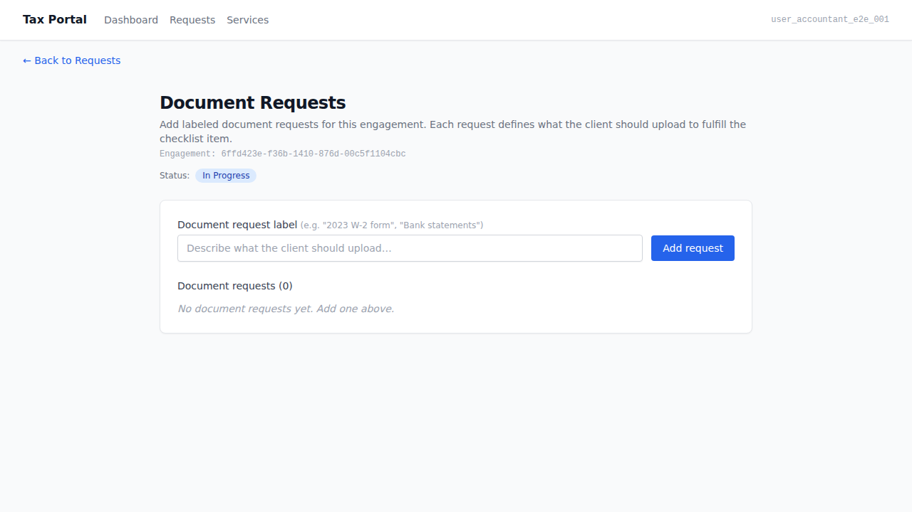
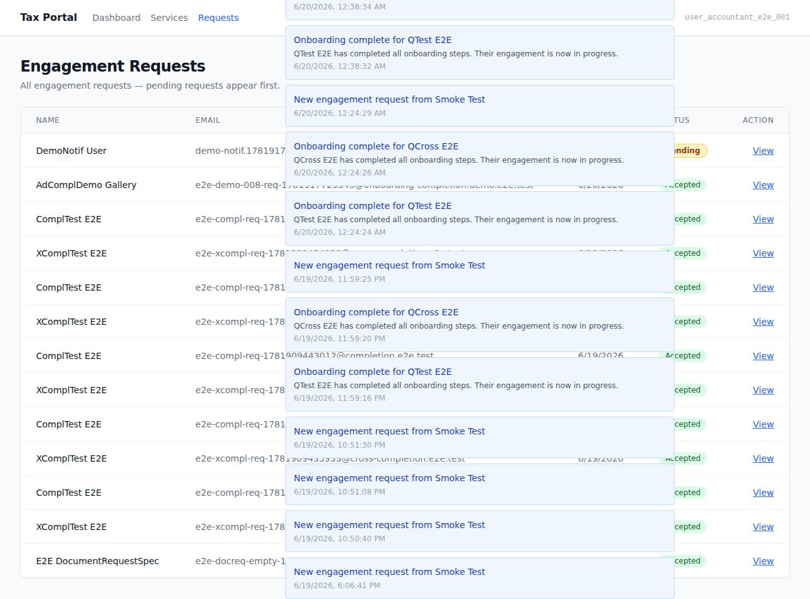
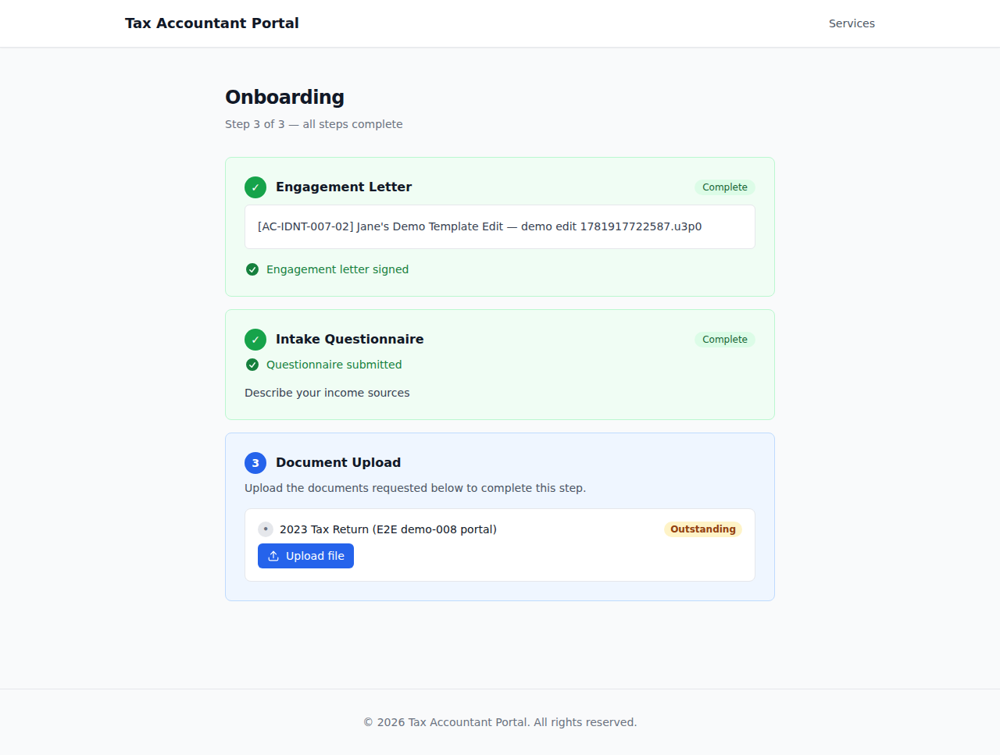

# EPIC-008 — Onboarding-completion capstone

**Brief**: BRIEF-008  
**Personas**: [jane-accountant](.planning/personas/jane-accountant.md) · [sarah-returning-client](.planning/personas/sarah-returning-client.md)  
**Flow**: [flow-onboarding](.planning/flows/flow-onboarding.md)  
**Policy**: [DEMO-POLICY.md](.orchestration/DEMO-POLICY.md) Part A — per-epic UI demo

---

## What this gallery shows

The completion capstone: when a client's three onboarding steps (engagement letter signed, intake questionnaire submitted, required documents uploaded) are all satisfied, the system auto-transitions the engagement from **New → In Progress** and emits an accountant-only `onboarding_completed` in-portal notification. This gallery captures those observables on both surfaces.

---

## 01. Jane sees engagement "In Progress" (auto-transition)  [AC-ONBD-006-01 / AC-ONBD-006-02]



**Surface:** Admin (Tax Portal — jane-accountant)  
**Persona action:** Jane navigates to the document-requests page for the engagement. She has not taken any manual action — the status change happened automatically when the client completed all three onboarding steps.  
**Observable:** The `data-testid="engagement-status"` badge displays `data-status="In Progress"` and contains the text "In Progress".  
**Proves:**
- **AC-ONBD-006-01** — onboarding completion triggers the engagement to transition New → In Progress.
- **AC-ONBD-006-02** — the transition is automatic; the accountant takes no manual action.

---

## 02. Jane receives an `onboarding_completed` notification  [AC-ONBD-007-01 / AC-ONBD-007-02]



**Surface:** Admin (Tax Portal — jane-accountant)  
**Persona action:** Jane navigates to /requests which renders the NotificationsIndicator. The notification feed shows the `onboarding_completed` notification.  
**Observable:** A `[data-notification-type="onboarding_completed"]` item is visible in the `[data-testid="notification-list"]`. Its title and body contain the client's name, identifying the engagement and its client.  
**Proves:**
- **AC-ONBD-007-01** — the accountant receives an in-portal notification when a client's onboarding completes.
- **AC-ONBD-007-02** — the notification identifies the engagement and its client (client full name in title and body).

---

## 03. Sarah's onboarding — steps 1+2 done, step 3 accessible (pre-completion state)  [AC-ONBD-005-01]



**Surface:** Portal (Client Portal — sarah-returning-client)  
**Persona action:** Sarah navigates to /onboarding. Steps 1 (engagement letter) and 2 (intake questionnaire) show "Complete" done-badges. Step 3 (document upload) is accessible and shows the upload widget.  
**Observable:** `done-badge-engagement-letter` and `done-badge-intake-questionnaire` visible; `onboarding-step-document-upload` has `data-accessible="true"`; `document-upload-active` widget visible.  
**Proves (partially):**
- **AC-ONBD-005-01** (pre-completion state) — steps 1 and 2 are satisfied. When Sarah uploads her documents (step 3), `processOnboardingCompletion` fires and all steps become done. The all-steps-done state is noted as a gap below.

> **KNOWN GAP — BUG-008-001:** The portal positive completion screen (all three steps showing `data-done="true"`, `data-remaining="0"`) is NOT capturable in this environment. The ADR-009 two-phase upload pipeline cannot complete end-to-end here because the Azurite SAS URL is signed against the container-internal address and is unreachable from the host Playwright browser. As a result, the document-upload step never reaches `data-status="fulfilled"` via the browser.
>
> This is a pre-existing EPIC-007 infra defect (NOT a BRIEF-008 regression). Filed as: `.implementation/tasks/BUG-008-001-azurite-sas-url-host-unreachable-from-playwright-browser.md`. AC-ONBD-005-01 is proved at the tier-3 integration layer by `onboarding-completion.test.ts` (processOnboardingCompletion unit tests). Screenshot 03 shows the highest-fidelity portal state the environment supports: the completion trigger is armed (all prerequisites met — only the upload remains), and the upload widget is live. The all-steps-done "positive completion" screen is a documented gap in this gallery.

---

## How to regenerate

```bash
# Pre-reqs: full docker-compose stack up + migrations + seed
docker compose --env-file .env.local up -d
pnpm db:migrate

# Admin surface (screenshots 01–02)
ADMIN_BASE_URL=http://localhost:13001 ADMIN_PORT=13001 pnpm --filter admin e2e:demo -- --grep "onboarding-completion.demo"

# Portal surface (screenshot 03)
pnpm --filter portal e2e:demo -- --grep "onboarding-completion.demo"

# Screenshots land in: docs/demos/EPIC-008/
```

> **Non-gating:** This gallery is not a delivery gate. The acceptance gate for EPIC-008 is the TASK-008-004 e2e run. See `.orchestration/DEMO-POLICY.md` Part A.
