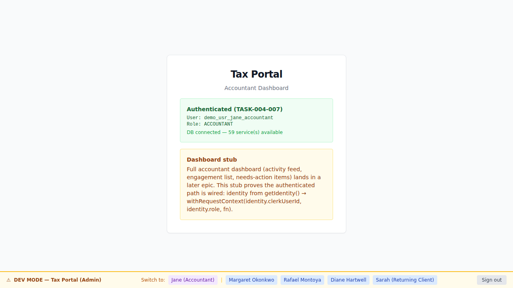
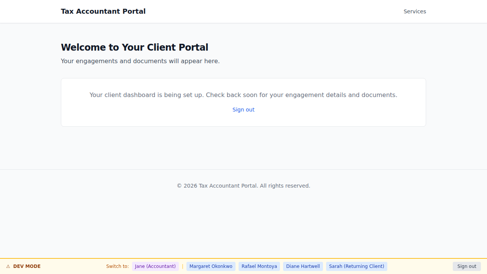

# EPIC-009 Demo Gallery — Dev Sign-In Lane

**Brief:** BRIEF-009 — PoC two-role dev sign-in lane  
**Personas:** [jane-accountant](.planning/personas/jane-accountant.md) · [sarah-returning-client](.planning/personas/sarah-returning-client.md)  
**Flows:** [flow-first-sign-in](.planning/flows/flow-first-sign-in.md) · [flow-role-redirect](.planning/flows/flow-role-redirect.md)  
**Policy:** [DEMO-POLICY.md](.orchestration/DEMO-POLICY.md) § Part A

A durable, AC-tagged screenshot gallery of the EPIC-009 dev sign-in lane. The lane enables
one-click, server-set-role sign-in for both roles under `AUTH_PROVIDER=mock`, landing on the
correct surface (apps/admin for ACCOUNTANT, apps/portal for CLIENT). The switcher (DevBanner)
enables in-app role/user switching with cross-app re-landing.

---

## 01. Jane-accountant signs in → lands on Tax Portal (apps/admin)  [AC-AUTH-013-01]



Jane-accountant (`accountId: "accountant-jane"`) signs in via the portal dev sign-in lane.
The server resolves her ACCOUNTANT role from the DEMO_ACCOUNTS manifest and redirects
cross-app to `apps/admin`. The Tax Portal (admin) renders with the DevBanner visible —
proof the ACCOUNTANT session was accepted by the admin surface.

**AC:** AC-AUTH-013-01 — ACCOUNTANT sign-in via the dev lane lands on Tax Portal (not Client Portal).  
**ADR-006:** ACCOUNTANT surface = apps/admin. **ADR-005:** role server-resolved, browser supplies only accountId.

---

## 02. Sarah-returning-client signs in → lands on Client Portal (apps/portal)  [AC-AUTH-013-01]



Sarah-returning-client (`accountId: "client-sarah"`, persona from `.planning/personas/sarah-returning-client.md`,
clerkId: `demo_usr_linda_svensson` — display-name mismatch is cosmetic per TASK-009-001 SDET note) signs in
via the dev sign-in lane. The server resolves her CLIENT role → she lands on `apps/portal /dashboard`.
The DevBanner is visible — proof the CLIENT session is established and the portal is serving authenticated content.

**AC:** AC-AUTH-013-01 — CLIENT sign-in via the dev lane lands on Client Portal (not admin).  
**ADR-006:** CLIENT surface = apps/portal. **ADR-010:** role-appropriate landing enforced by middleware.

---

## 03. Role/user switcher hop: CLIENT → ACCOUNTANT re-lands on apps/admin  [switcher dev-acceptance]


After signing in as CLIENT (sarah), the tester clicks the `accountant-jane` switch button in the
portal DevBanner. The prior CLIENT session is replaced; the browser is redirected to `apps/admin`
via `window.location.href`. The admin surface renders with the DevBanner visible — proof the
ACCOUNTANT session was accepted and the switcher hop completed correctly.

**Dev-acceptance:** switcher replaces the prior session and re-lands on the correct app for the
newly chosen role. **ADR-005:** switcher submits only accountId; server resolves the new role.
**ADR-010:** cross-app re-landing on role switch.

---

## How to regenerate

```bash
# Bring up the container stack (neighbor-port-squat overrides apply)
docker compose up -d --no-deps --env-file .env.local
pnpm db:migrate
pnpm db:seed

# Portal surface (screens 02 + 03)
pnpm --filter portal e2e:demo

# Admin surface (screen 01)
ADMIN_BASE_URL=http://localhost:13001 ADMIN_PORT=13001 pnpm --filter admin e2e:demo
```

Output PNGs land in `docs/demos/EPIC-009/` (this directory).
