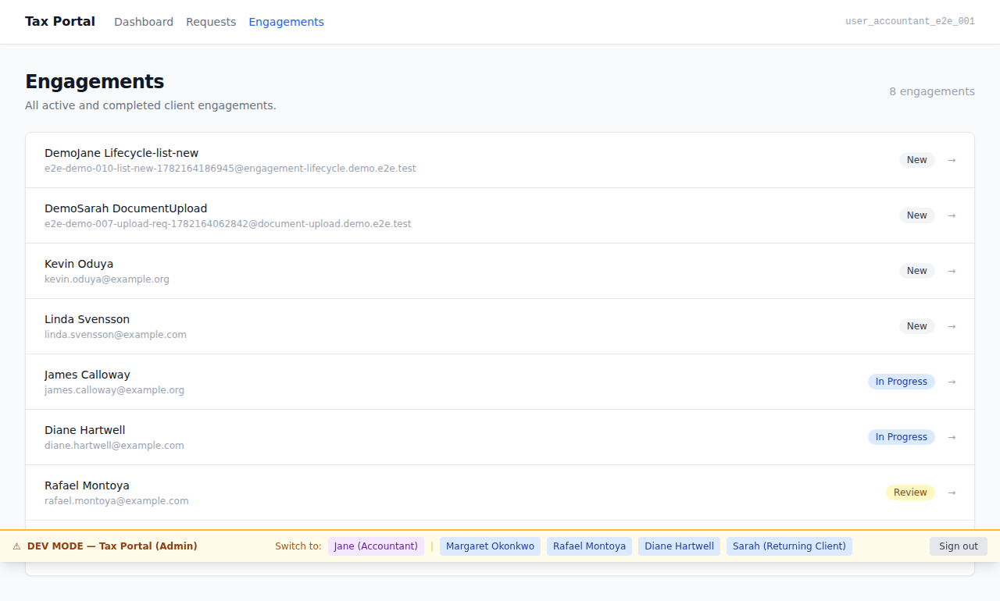
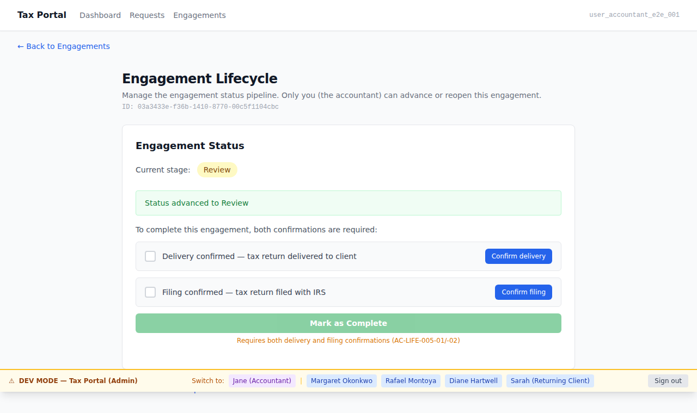
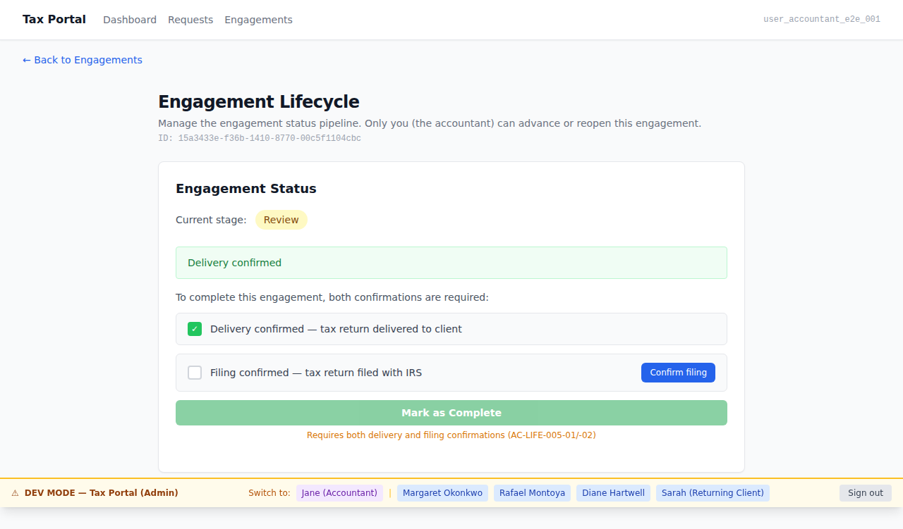
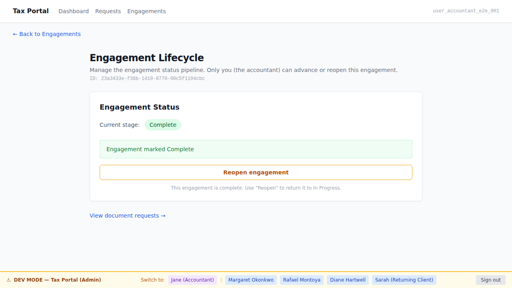
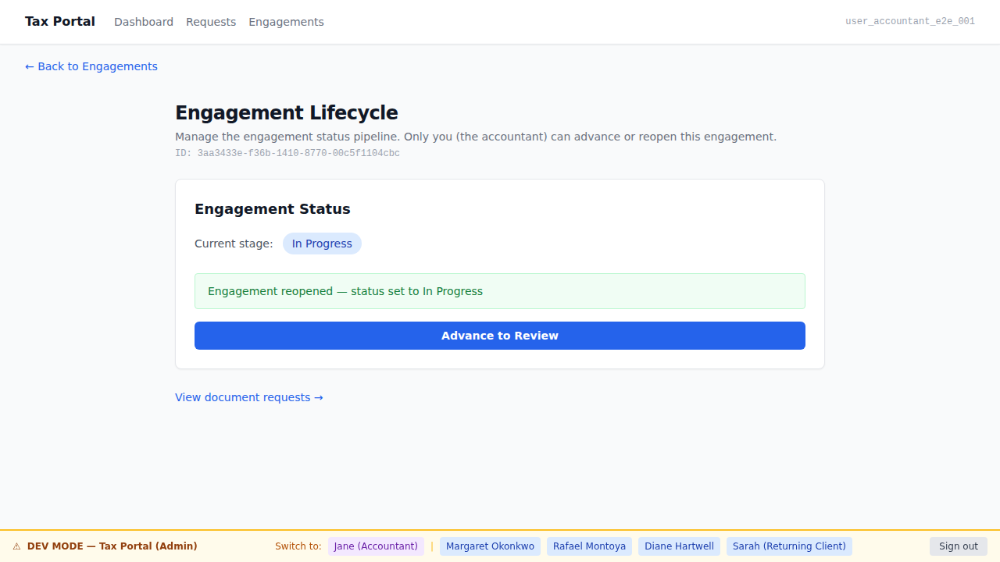
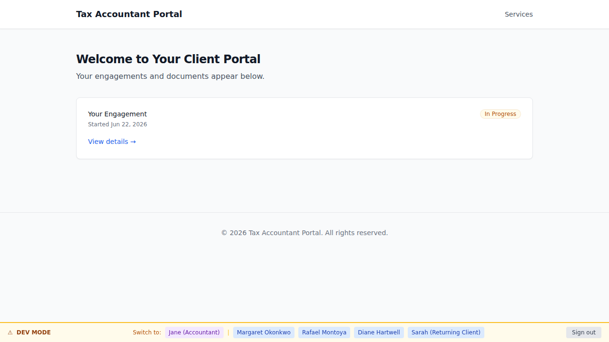

# EPIC-010 Demo Gallery — Engagement Lifecycle Pipeline

**Brief:** BRIEF-010 — Engagement lifecycle pipeline & engagement visibility  
**Personas:** [jane-accountant](.planning/personas/jane-accountant.md) · [sarah-returning-client](.planning/personas/sarah-returning-client.md) · [martha-and-james-married-couple](.planning/personas/martha-and-james-married-couple.md)  
**Flows:** [flow-engagement-lifecycle](.planning/flows/flow-engagement-lifecycle.md)  
**Policy:** [DEMO-POLICY.md](.orchestration/DEMO-POLICY.md) § Part A

A durable, AC-tagged screenshot gallery of the EPIC-010 engagement lifecycle pipeline and
client-facing engagement labels. Covers the full admin-surface lifecycle journey
(jane-accountant advances New → In Progress → Review → Complete with the two-confirmation
gate, then reopens) and the portal-surface client label view (sarah / martha see the
friendly labels, including the hidden Review stage displayed as "In Progress").

---

## Admin surface (jane-accountant, apps/admin)

---

## 01. Jane views engagements list — New status  [AC-LIFE-001-02 / AC-AUTH-002-01 / AC-AUTH-002-02]



Jane-accountant navigates to `/engagements`. The list shows an engagement in **New** status —
the default for a freshly created engagement. This proves the accountant has full visibility
across all engagements (AC-AUTH-002-01/-02) and that a new engagement begins in New (AC-LIFE-001-02).

**AC:** AC-LIFE-001-02 — newly created engagement begins in New.  
**AC:** AC-AUTH-002-01 / AC-AUTH-002-02 — accountant can view all engagements.  
**ADR-006:** admin surface (accountant-only).

---

## 02. Jane advances New → In Progress  [AC-LIFE-003-01 / AC-LIFE-001-03]


Jane clicks the "Advance to In Progress" button. The status badge updates immediately to
**In Progress**. This proves the accountant can manually advance an engagement (AC-LIFE-003-01)
and the New → In Progress step is the first forward-pipeline move (AC-LIFE-001-03).

**AC:** AC-LIFE-003-01 — accountant changes engagement status.  
**AC:** AC-LIFE-001-03 — New → In Progress forward pipeline order.  
**ADR-003:** session-verified accountant drives the transition.

---

## 03. Jane advances In Progress → Review  [AC-LIFE-001-03]



From In Progress, Jane advances to **Review** — the accountant's internal review stage before
delivery. The status badge shows "Review". This completes the second forward-pipeline step and
illustrates AC-LIFE-004-01 (Review means accountant reviewing own work, not a client step).

**AC:** AC-LIFE-001-03 — In Progress → Review forward pipeline order.  
**AC:** AC-LIFE-004-01 — Review represents accountant reviewing her own work.  
**ADR-006:** Review is an internal admin stage; clients never see "Review".

---

## 04. Jane confirms delivery (first of two confirmations)  [AC-LIFE-005-01]



Jane clicks "Confirm Delivery". The delivery check indicator turns confirmed. The **Complete**
button remains disabled — one confirmation is not enough (AC-LIFE-005-03 negative case).

**AC:** AC-LIFE-005-01 — explicit delivery-to-client confirmation required.  
**AC:** AC-LIFE-005-03 (partial) — both confirmations required; one alone is insufficient.

---

## 05. Both confirmed → engagement marked Complete  [AC-LIFE-005-02 / AC-LIFE-005-03 / AC-LIFE-001-03]



With both confirmations pre-set, the **Complete** button is enabled. Jane clicks it.
The engagement advances to **Complete** and a Reopen button appears.
This is the two-confirmation gate positive case and the final forward-pipeline step.

**AC:** AC-LIFE-005-02 — explicit filing-with-tax-authority confirmation required.  
**AC:** AC-LIFE-005-03 — both confirmations present → Complete allowed (positive case).  
**AC:** AC-LIFE-001-03 — Review → Complete final pipeline step.  
**AC:** AC-LIFE-006-01 (affordance) — Reopen button appears after Complete.

---

## 06. Jane reopens the Complete engagement  [AC-LIFE-006-01]



Jane clicks **Reopen**. The engagement reverts to **In Progress** (back into active work).
The advance button reappears. Proves the accountant-only reopen capability.

**AC:** AC-LIFE-006-01 — accountant can reopen a Complete engagement back into active work.  
**ADR-006:** Reopen is admin-surface-only; no reopen affordance exists in apps/portal.

---

## Portal surface (sarah-returning-client + martha-and-james, apps/portal)

---

## 07. Sarah sees "Received" label (internal New)  [AC-LIFE-002-01]


Sarah's engagement is in internal status **New**. The portal dashboard displays the
friendly label **"Received"** — the raw internal name is never shown.

**AC:** AC-LIFE-002-01 — New → "Received".  
**AC:** AC-AUTH-003-01 — Sarah sees only her own engagement (FILTER-governed).  
**ADR-005:** pol_Engagement FILTER enforces isolation; admin pool for seed only.

---

## 08. Sarah sees "In Progress" — engagement internally in Review  [AC-LIFE-002-02 / AC-LIFE-004-02 / AC-LIFE-004-03]



Sarah's engagement is internally in **Review** (accountant reviewing own work). The portal
shows **"In Progress"** — the word "Review" never appears in the DOM. No approval or
action-required UI is shown to the client.

**AC:** AC-LIFE-002-02 — internal Review is hidden; shown as "In Progress". "Review" never appears in the client DOM.  
**AC:** AC-LIFE-004-02 — Review stage requires no client action.  
**AC:** AC-LIFE-004-03 — Review is not presented as a client approval step.

---

## 09. Sarah sees "Completed" — retains portal access after completion  [AC-LIFE-002-01 / AC-AUTH-008-01 / AC-AUTH-008-02]


Sarah's engagement is **Complete**. The portal shows **"Completed"** and the dashboard is
fully accessible — proving that completion does not revoke client portal access.
No reopen or status-change controls are present.

**AC:** AC-LIFE-002-01 — Complete → "Completed".  
**AC:** AC-AUTH-008-01 — client retains sign-in ability after completion.  
**AC:** AC-AUTH-008-02 — client can view completed engagement indefinitely.  
**AC:** AC-LIFE-006-02 (absence) — no reopen affordance in apps/portal.  
**ADR-018:** completion starts retention clock; does NOT revoke access.

---

## 10. Martha sees "Received" — three-state arc illustrated  [AC-LIFE-002-03]


Martha (from the martha-and-james-married-couple persona) views her dashboard. Her engagement
shows **"Received"**. Combined with screens 07–09, this confirms that clients across the
lifecycle see exactly the three distinct states: "Received", "In Progress", "Completed".

> **Scope note:** Multi-participant (joint) engagement modeling is EPIC-012 scope (BRIEF-010 § Out of scope).
> This screenshot illustrates the label pattern for a second-named client persona. A literal
> shared-engagement view for Martha and James will be captured when EPIC-012 delivers.

**AC:** AC-LIFE-002-03 — clients perceive exactly three distinct states: "Received", "In Progress", "Completed".

---

## How to regenerate

```bash
# Bring up the container stack (neighbor-port-squat overrides apply)
docker compose up -d --no-deps --env-file .env.local
pnpm db:migrate
pnpm db:seed

# Admin surface (screens 01–06)
ADMIN_BASE_URL=http://localhost:13001 ADMIN_PORT=13001 pnpm --filter admin e2e:demo

# Portal surface (screens 07–10)
pnpm --filter portal e2e:demo
```

Output PNGs land in `docs/demos/EPIC-010/` (this directory).
