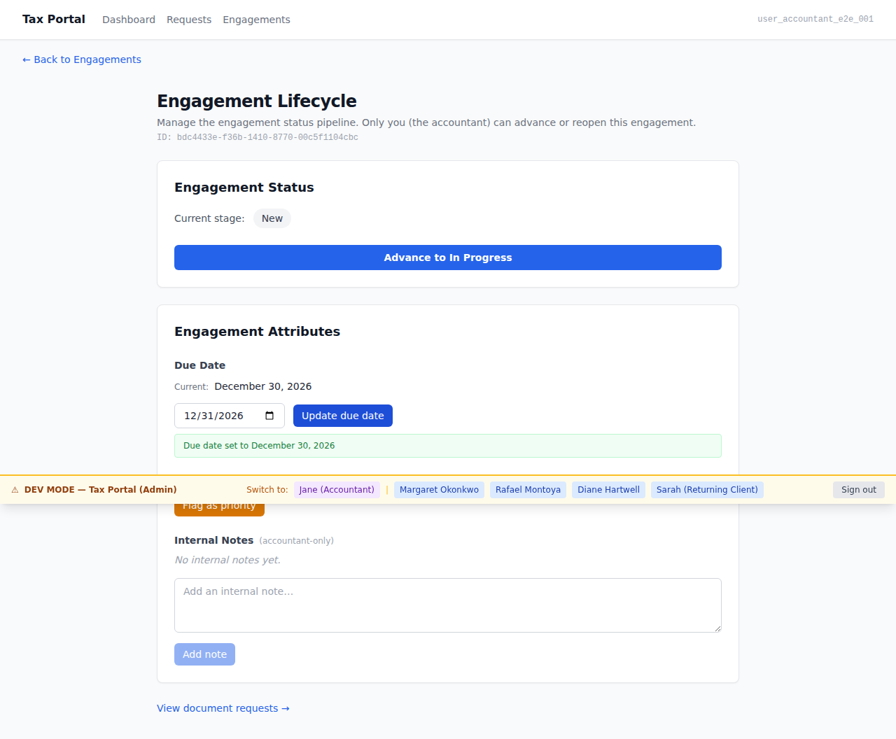
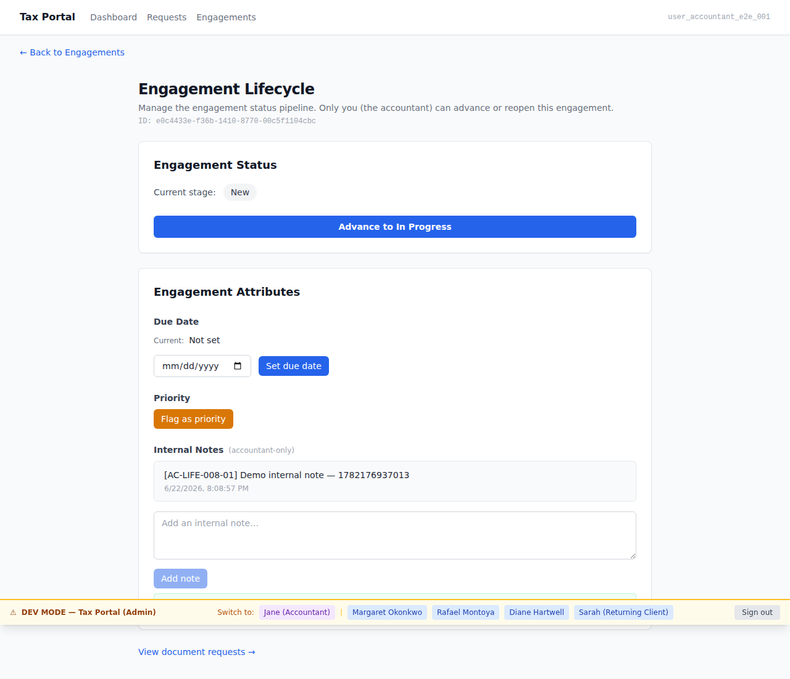
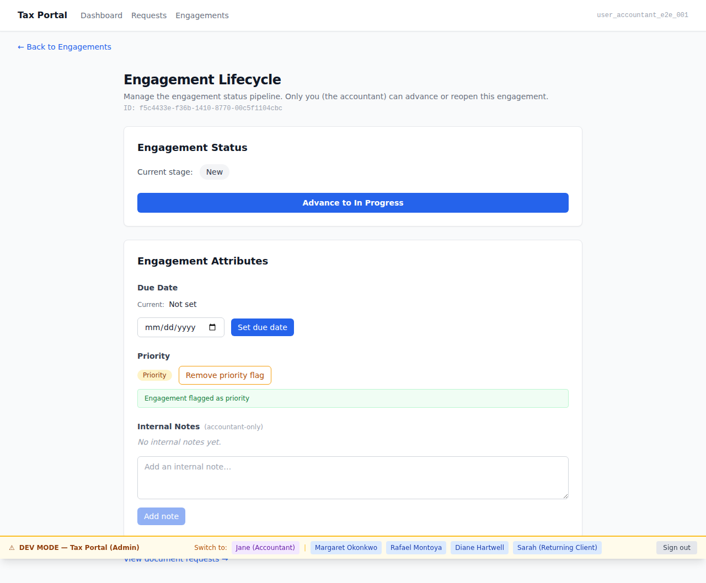
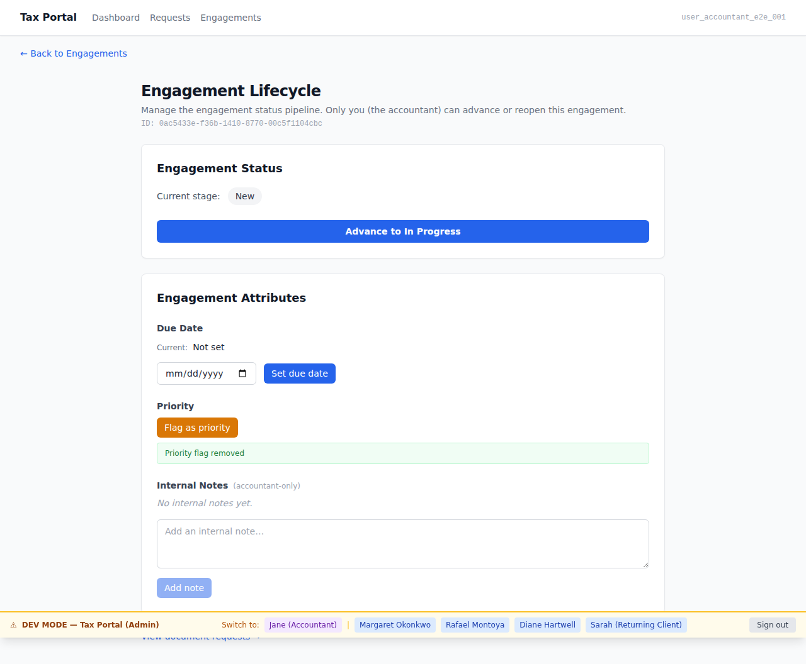

# EPIC-011 Demo Gallery — Engagement Attributes

**Brief:** BRIEF-011 — Engagement attributes (due date, internal notes, priority flag)  
**Personas:** [jane-accountant](.planning/personas/jane-accountant.md)  
**Flows:** [flow-engagement-lifecycle](.planning/flows/flow-engagement-lifecycle.md)  
**Policy:** [DEMO-POLICY.md](.orchestration/DEMO-POLICY.md) § Part A

A durable, AC-tagged screenshot gallery of the EPIC-011 engagement attributes slice. Covers
jane-accountant's attribute-management journeys on the admin surface: setting and updating a
due date, recording an internal note (private to the accountant), and flagging then unflagging
an engagement as a priority.

> **Security note (AC-LIFE-008-02/-03):** Internal notes are NEVER shown in `apps/portal`.
> The RLS policy (`pol_EngagementNote`, ADR-005) ensures a CLIENT principal reads zero notes
> server-side. This gallery captures only the positive accountant case on the admin surface;
> the confidentiality negative is proven by the tier-3 integration tests in TASK-011-001/-002.

---

## Admin surface (jane-accountant, apps/admin)

---

## 01. Jane sets a due date on an engagement  [AC-LIFE-007-01]



Jane-accountant navigates to an engagement with no due date set. She enters a date in the
due-date field and clicks **Set due date**. The due-date display updates from "Not set" to
the chosen date (December 31, 2026), confirming the attribute was persisted.

**AC:** AC-LIFE-007-01 — the accountant can set a due date on an engagement.  
**ADR-006:** admin surface — due-date writes are accountant-only.  
**ADR-003:** session-verified accountant drives the attribute write.

---

## 02. Jane updates an existing due date  [AC-LIFE-007-02]


Jane navigates to an engagement that already has a due date (November 1, 2026). She changes
it to December 31, 2026. The due-date display reflects the new value; the old date (November)
is no longer shown. The "Set due date" button reads "Update due date" when a date is already
set, confirming the update path is distinct from the initial-set path.

**AC:** AC-LIFE-007-02 — the accountant can update an engagement's due date after it has been set.  
**ADR-006:** admin surface — due-date writes are accountant-only.

---

## 03. Jane records an internal note  [AC-LIFE-008-01]



Jane opens an engagement and types an internal note in the note textarea. The **Add note**
button is disabled until she types something (empty-textarea guard). After clicking it, the
note appears in the notes list below, and the textarea clears. The action status confirms
the note was recorded.

**AC:** AC-LIFE-008-01 — the accountant can record internal notes on an engagement.  
**ADR-006:** admin surface — internal notes are NEVER surfaced in `apps/portal` (CS-TS-003).  
**ADR-005:** `pol_EngagementNote` RLS policy: CLIENT reads ZERO / null reads ZERO / ACCOUNTANT reads.

---

## 04. Jane flags an unflagged engagement as priority  [AC-LIFE-009-01]



Jane opens an unflagged engagement. The priority badge is absent and the toggle button reads
**"Flag as priority"** (`aria-pressed="false"`). She clicks it. The priority badge appears,
the action status confirms success, and the toggle button changes to **"Remove priority flag"**
(`aria-pressed="true"`).

**AC:** AC-LIFE-009-01 — the accountant can flag/mark an engagement as prioritized.  
**ADR-006:** admin surface — flag writes are accountant-only.

---

## 05. Flagged state — "Given" context for the unflag action  [AC-LIFE-009-01 / AC-LIFE-009-02]


This screenshot captures the engagement in its flagged state after Jane clicked "Flag as
priority". The priority badge is visible; the toggle shows **"Remove priority flag"**. This is
the "Given: a flagged engagement" state for AC-LIFE-009-02 — immediately preceding the unflag
action shown in screen 06.

**AC:** AC-LIFE-009-01 (positive state — badge present, toggle shows Remove).  
**AC:** AC-LIFE-009-02 ("Given" state — this is what the accountant removes).

---

## 06. Jane removes the priority flag  [AC-LIFE-009-02]



From the flagged state (screen 05), Jane clicks **"Remove priority flag"**. The priority badge
disappears, the action status confirms "priority flag removed", and the toggle reverts to
**"Flag as priority"** (`aria-pressed="false"`). The engagement is no longer marked as
prioritized.

**AC:** AC-LIFE-009-02 — the accountant can remove the flag/priority marker from an engagement.  
**ADR-006:** admin surface — flag writes are accountant-only.

---

## How to regenerate

```bash
# Bring up the container stack (neighbor-port-squat overrides apply)
docker compose up -d --no-deps --env-file .env.local
pnpm db:migrate
pnpm db:seed

# Admin surface (screens 01–06)
ADMIN_BASE_URL=http://localhost:13001 ADMIN_PORT=13001 pnpm --filter admin e2e:demo
```

Output PNGs land in `docs/demos/EPIC-011/` (this directory).
