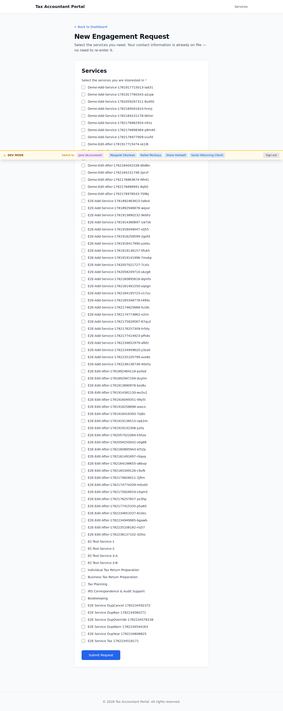
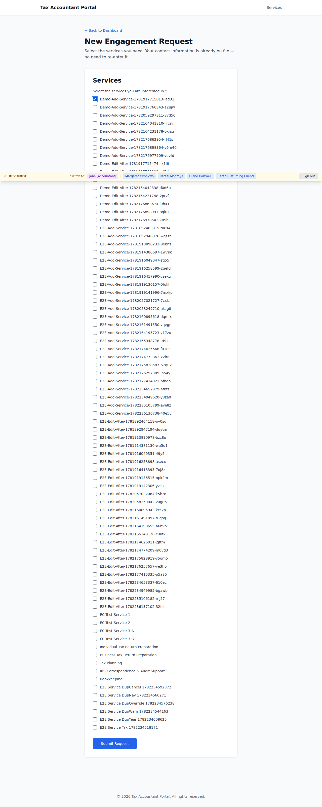
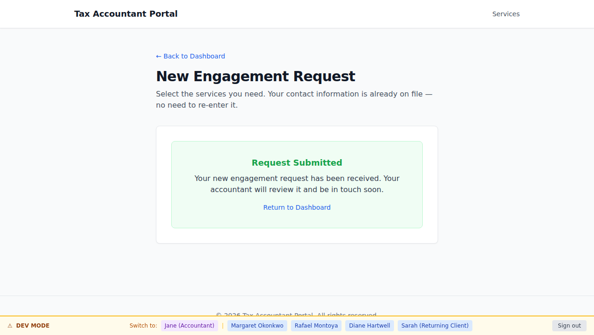
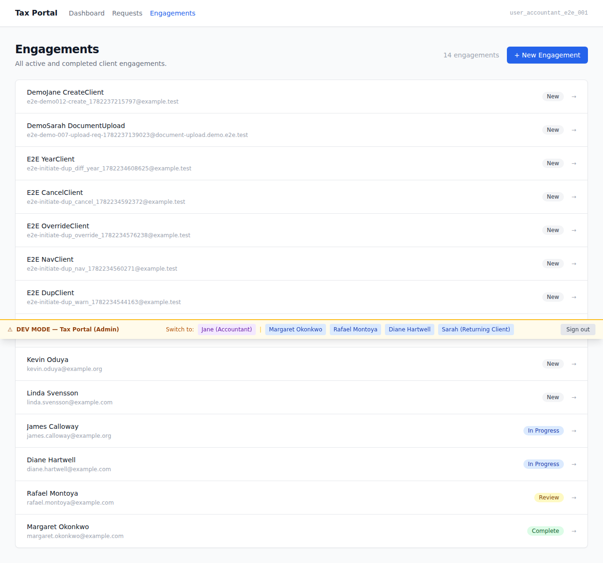
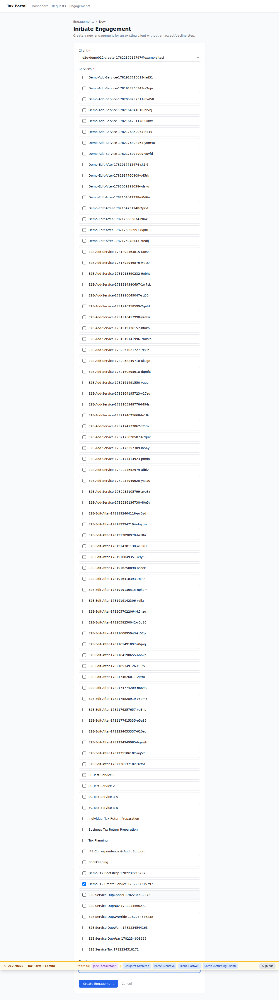
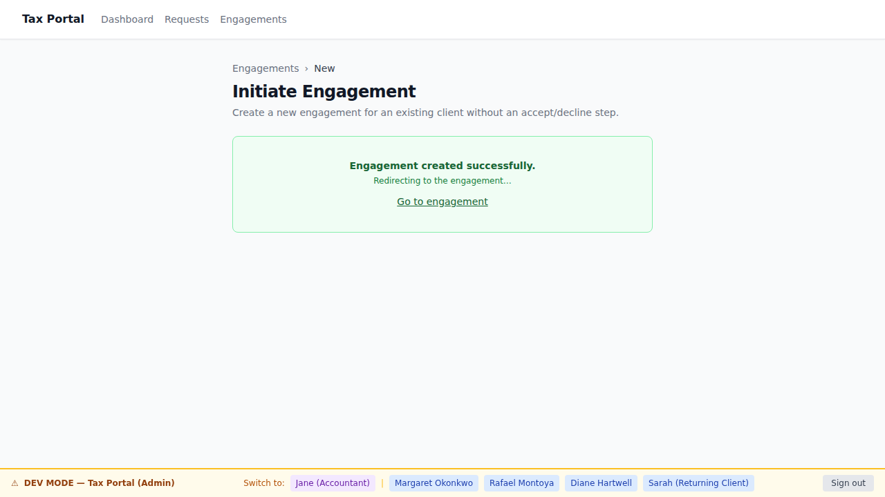
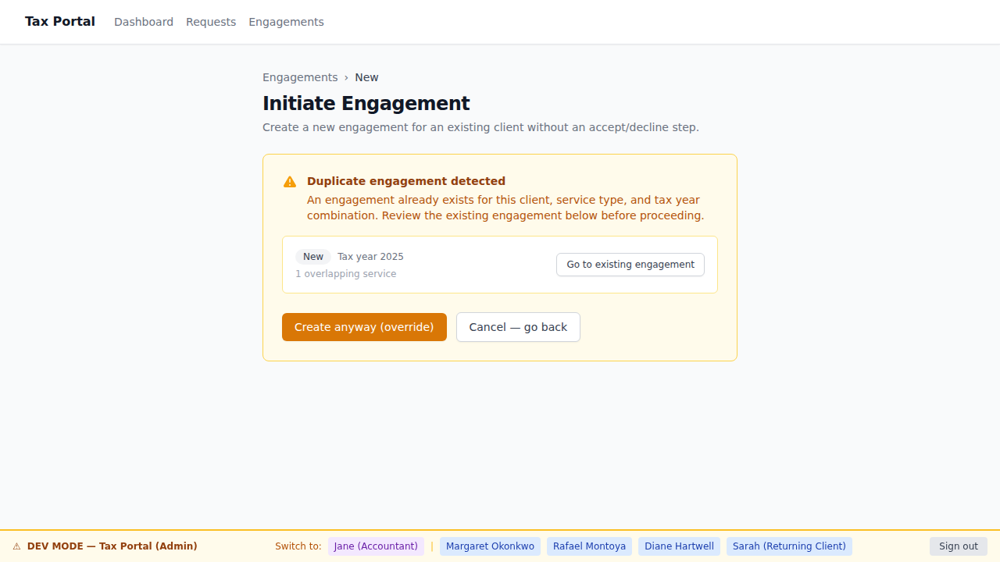
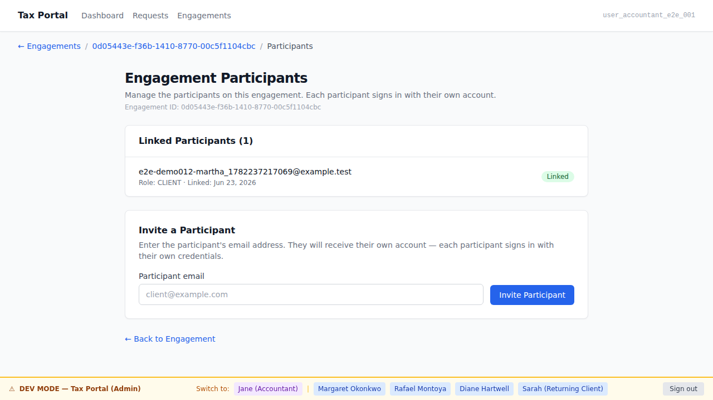
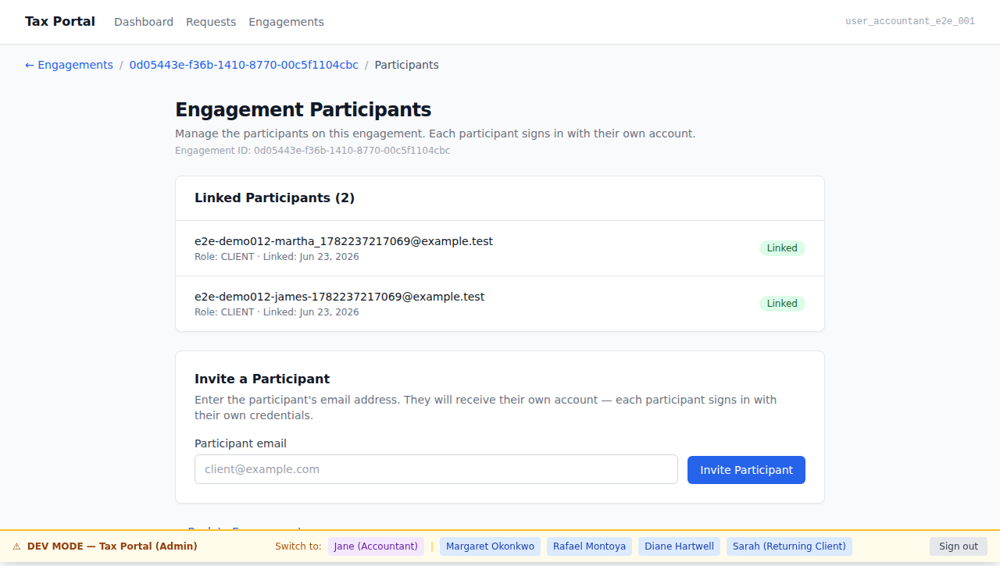

# EPIC-012 Demo Gallery — Engagement creation paths & multi-participant engagements

**Personas:**
- `sarah-returning-client` (`.planning/personas/sarah-returning-client.md`) — portal surface
- `jane-accountant` (`.planning/personas/jane-accountant.md`) — admin surface
- `martha-and-james-married-couple` (`.planning/personas/martha-and-james-married-couple.md`) — admin + portal surfaces

**Flows:**
- `flow-engagement-request` (`.planning/flows/flow-engagement-request.md`)
- `flow-engagement-lifecycle` (`.planning/flows/flow-engagement-lifecycle.md`)

**Policy:** `.orchestration/DEMO-POLICY.md` — AC-tagged screenshots, non-gating gallery.

---

## Portal surface — sarah-returning-client

### 01. Returning-client request form  [AC-DOOR-009-01]

Sarah (signed-in existing client) navigates to `/engagements/new`. The returning-client
request form loads inside the portal — she stays on the portal surface, no redirect.



### 02. Service selection checklist  [AC-DOOR-009-02]

Sarah sees the active-services checklist and selects one service. The form lets her
choose one or more active services for the request.



### 03. No contact fields — on-file message  [AC-DOOR-009-03]

Sarah's contact info is already on file. The form shows a "Contact on file" message and
has no `firstName`/`lastName`/`email` input fields — she is not asked to re-enter them.


### 04. Submission success — routed to accountant  [AC-DOOR-009-04]

After submitting, Sarah sees the success confirmation inside the portal. The request is
routed to the accountant inbox exactly like a front-door request.



---

## Admin surface — jane-accountant: initiate engagement

### 05. "New Engagement" button on engagement list  [AC-DOOR-010-01]

Jane is on `/engagements`. The "New Engagement" button is visible — she can initiate
a new engagement for an existing client directly from her surface.



### 06. Initiate-engagement form  [AC-DOOR-010-02]

Jane reaches `/engagements/new`. The form shows the client picker, active-services
checkboxes, and a tax-year input. She selects one or more active services.



### 07. Engagement created — no accept/decline step  [AC-DOOR-010-03, AC-DOOR-010-04]

The engagement is created immediately (success or redirect to the new engagement page).
No accept/decline review step — the accountant is the originator. The engagement is
associated with the chosen client.



---

## Admin surface — jane-accountant: duplicate guard

### 08. Duplicate warning shown  [AC-LIFE-011-02, AC-LIFE-011-04]

Jane attempts to create an engagement for the same (client, service, tax year) that
already exists. The duplicate warning panel appears showing the existing matching
engagement — no second engagement is created. The condition is surfaced, not silently
blocked.



### 09. Override creates second engagement  [AC-LIFE-011-03]

Jane clicks "Create anyway (override)" from the warning. The second engagement is
created. From the warning she could also have navigated to the existing engagement
instead.


---

## Admin surface — martha-and-james: two-participant engagement

### 10. Participants page — one participant (martha)  [AC-AUTH-007-01]

Jane navigates to the participants page for a new engagement. The primary client
(martha) is already listed — one participant so far. The engagement can hold more.



### 11. Invite second participant (james) — two now listed  [AC-AUTH-007-01, AC-LIFE-012-02, AC-LIFE-012-03]

Jane fills james's email in the invite control and submits. The page reloads and now
shows two participants (martha and james) associated with the same engagement.



### 12. Two distinct email addresses — separate accounts  [AC-AUTH-007-02, AC-LIFE-012-02]

Both participants are listed with their own distinct email addresses. Martha and james
each have their own portal account — no shared login.


---

## How to regenerate

```bash
# Bring up the full stack
docker compose up -d

# Run the @demo specs (writes to docs/demos/EPIC-012/ only — RETRO-006 scope discipline)
ADMIN_BASE_URL=http://localhost:13001 ADMIN_PORT=13001 pnpm --filter portal e2e:demo
ADMIN_BASE_URL=http://localhost:13001 ADMIN_PORT=13001 pnpm --filter admin e2e:demo
```

Screenshots are committed to `docs/demos/EPIC-012/` via the post-delivery docs fast-lane PR
(see `.orchestration/MERGE-POLICY.md`). The Playwright HTML report (`playwright-report/`)
remains gitignored and is the deep-dive artifact.
