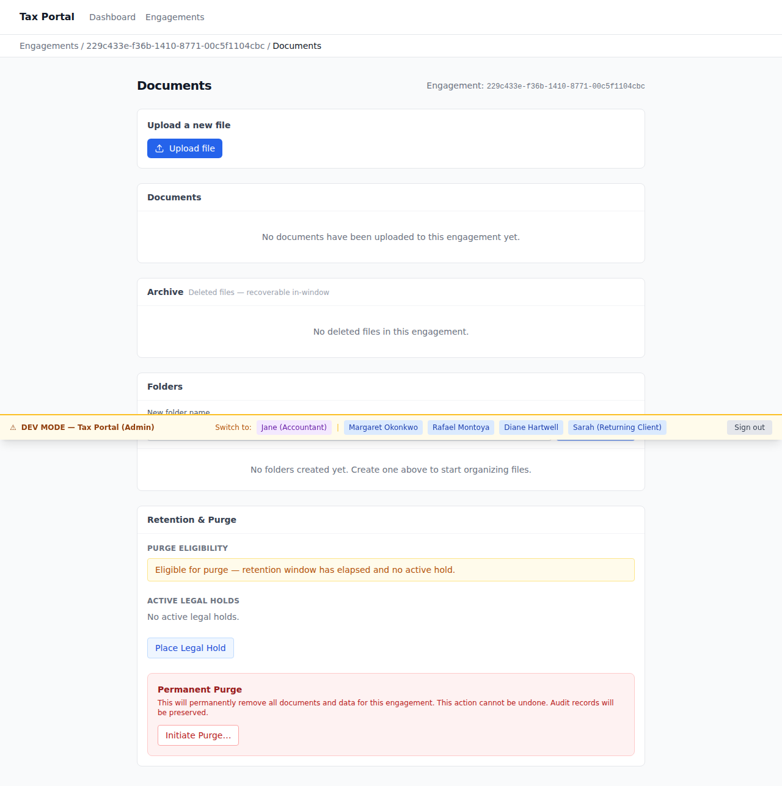
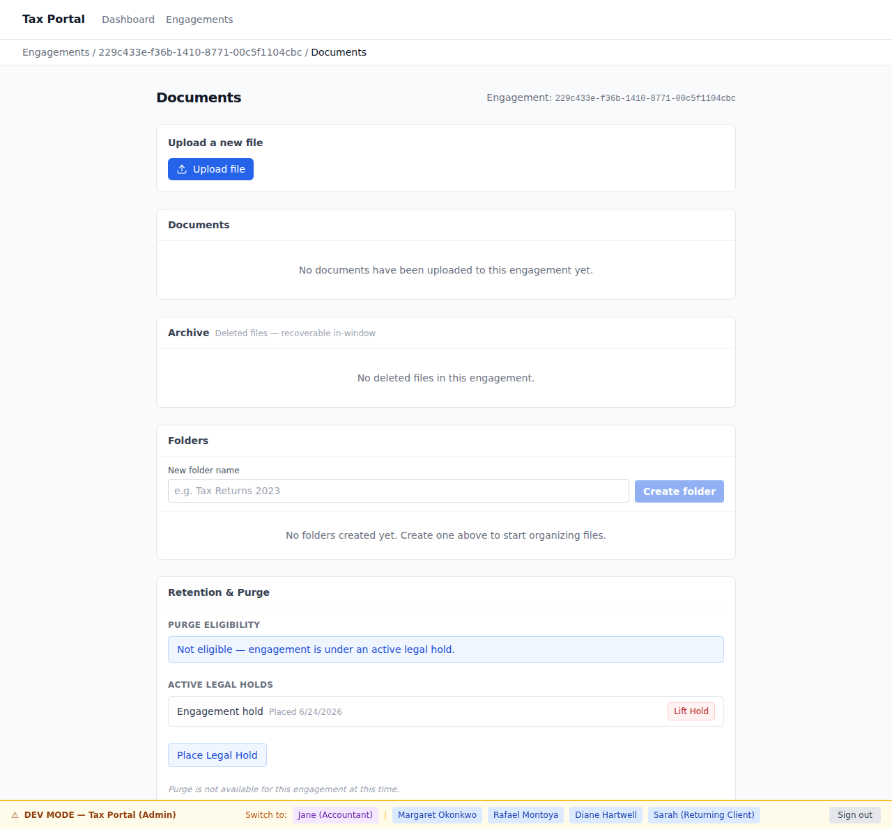
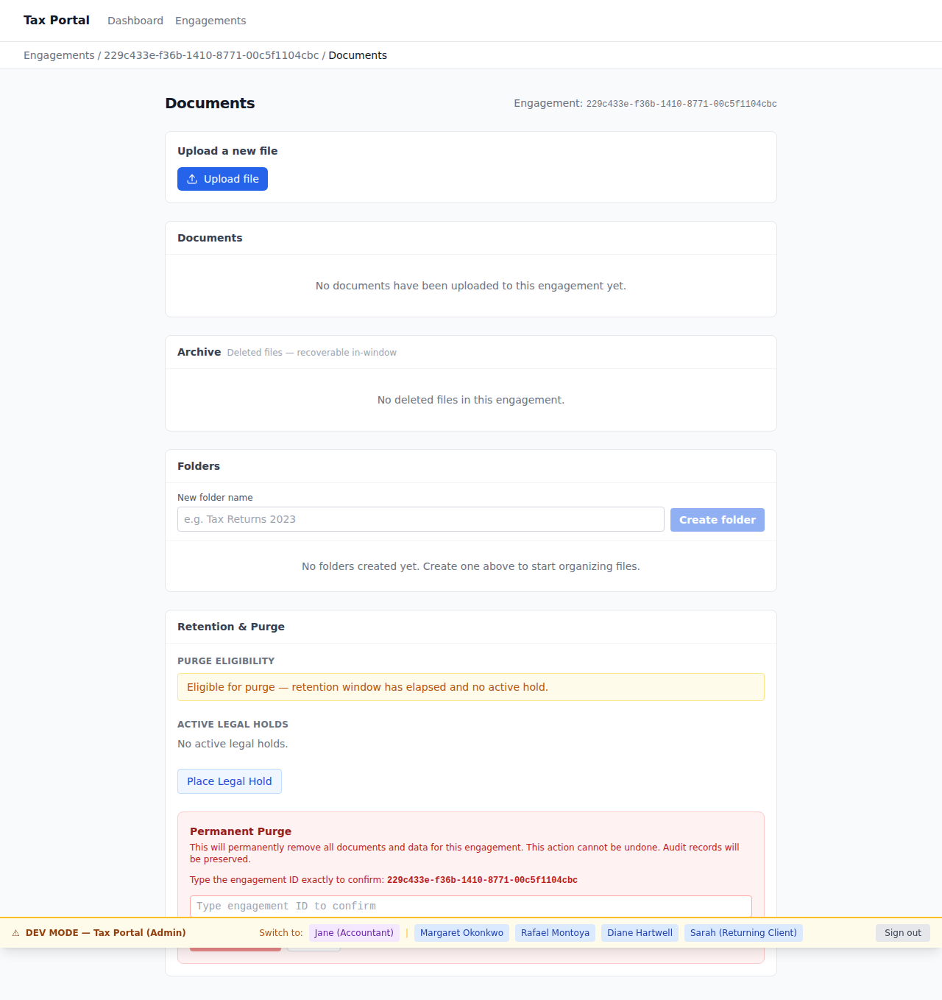
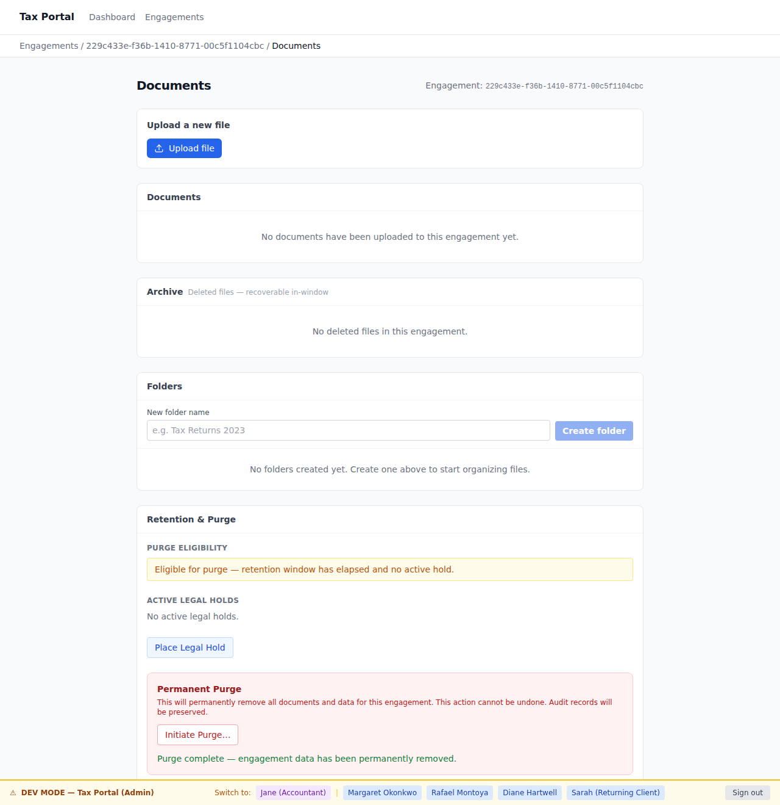

# EPIC-015 — Post-retention purge & legal hold (UI demo gallery)

**Persona:** [jane-accountant](../../../.planning/personas/jane-accountant.md) · **Flow:** [flow-document-lifecycle](../../../.planning/flows/flow-document-lifecycle.md) · **Surface:** apps/admin (Tax Portal)
**Source:** `apps/admin/e2e/demo/purge-legal-hold.demo.spec.ts` (`@demo`) · **Non-gating** (the e2e gate is the gate).

The accountant's post-retention destructive-lifecycle journey: on an engagement whose 7-year
retention window has elapsed, place a **legal hold** (which suspends purge indefinitely), see the
held engagement reported as **blocked-by-hold**, **lift** the hold to restore eligibility, then
**explicitly confirm** a permanent **purge** — and confirm the **audit record survives** the purge.
Purge and legal hold are **accountant-only**: the client surface (apps/portal) exposes **no** purge,
hold, or lift capability (proven separately by `apps/portal/e2e/specs/no-client-purge-hold.spec.ts`).

| # | Screen | AC |
| - | ------ | -- |
| 01 | Purge-eligible engagement with the Place Legal Hold control | AC-FILE-014-01 |
| 02 | Held engagement reports blocked-by-hold — purge is suspended | AC-FILE-014-03 |
| 03 | The active hold with its Lift control | AC-FILE-014-05 / AC-FILE-014-07 |
| 04 | Eligibility restored after lift — confirm-before-purge (submit disabled until the ID is typed) | AC-FILE-013-03 |
| 05 | The confirmed purge — engagement data permanently removed | AC-FILE-013-03 |
| 06 | The audit trail survives the purge (engagement.purged row retained) | AC-NFR-010-07 / AC-FILE-013-06 |

## 01. Place a legal hold on a purge-eligible engagement [AC-FILE-014-01]

## 02. Held engagement is blocked-by-hold — cannot be purged [AC-FILE-014-03]

## 03. Lift the legal hold [AC-FILE-014-07]

## 04. Eligibility restored — confirm-before-purge is required [AC-FILE-013-03]

## 05. The confirmed purge — data permanently removed [AC-FILE-013-03]

## 06. The audit record survives the purge [AC-NFR-010-07]

---

6 screens · regenerate via `pnpm --filter admin e2e:demo` against the local docker-compose stack
(`ADMIN_BASE_URL=http://localhost:13001 ADMIN_PORT=13001 pnpm --filter admin e2e:demo`).
